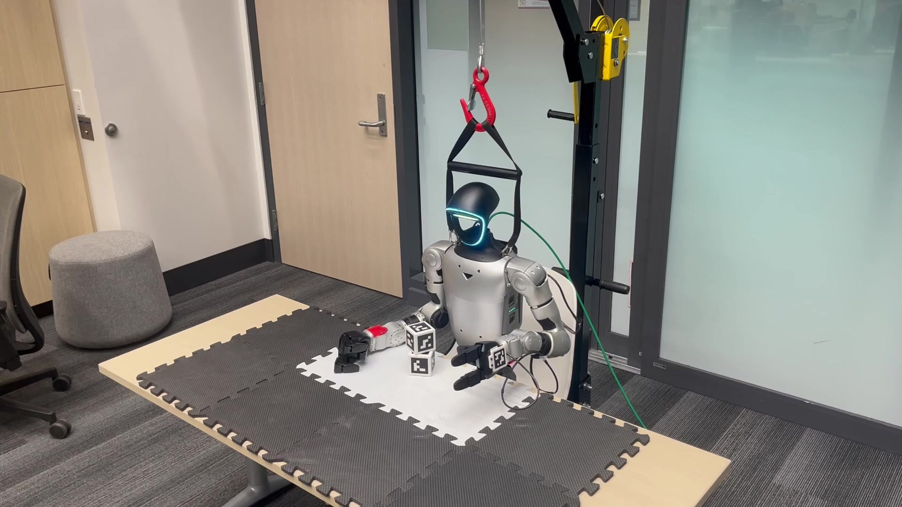

# Working with the G1

A practical guide to research tools and hardware lessons from work on the Unitree G1.

[](https://sri299792458.github.io/g1-research-docs/manipulation/tasks.html#physical-demonstration)

*Watch the physical pickup, stacking and release demonstration in the guide.*

**[Read the guide](https://sri299792458.github.io/g1-research-docs/)** ·
[Repositories and setup](https://sri299792458.github.io/g1-research-docs/start/setup.html) ·
[Code index](https://sri299792458.github.io/g1-research-docs/reference/code-index.html) ·
[Contributing](CONTRIBUTING.md)

Cube stacking brings together the work on calibrated perception, grasp
qualification, CuRobo planning, control and recording. The guide explains those
systems so another researcher can adapt them to a different experiment. It also
covers the initial MuJoCo digital twin, Dex3 pressure sensing and printable
targets and mounts, with photographs, demonstrations and pinned source links.

This repository contains the documentation; the
[source catalog](docs/reference/sources.md) identifies the implementation
repositories. Demonstrated August code and September calibration development
remain distinct. Chapters distinguish physical trials, simulation and offline
checks, and explain the limits of each result.

The guide is a working draft by [srinivas](https://github.com/sri299792458).
[About](docs/about.md) records the project context;
the [review queue](docs/reference/review.md) lists the remaining gaps.

## Preview locally

The site uses **Sphinx + MyST Markdown + Furo**. No ROS, CUDA or robot access
is needed to build it. From the repository root, with Python 3.10 or newer:

```bash
python3 -m venv .venv
.venv/bin/python -m pip install -r requirements-docs.txt
.venv/bin/sphinx-build -n -W --keep-going -b html docs site
.venv/bin/python -m http.server 8000 --directory site --bind 127.0.0.1
```

Open `http://127.0.0.1:8000`. Rebuild and refresh after editing. The
[maintenance page](docs/reference/maintenance.md) includes the uv alternative,
dependency updates, navigation and GitHub Pages setup.

## Repository map

| Path | Purpose |
|---|---|
| `docs/` | Markdown chapters and site configuration |
| `docs/assets/` | Selected images, captions/provenance catalog and minimal CSS |
| `docs/assets/code-map.json` | Exact files, hashes, symbols and public URLs behind code maps |
| `tools/check_code_map.py` | Optional static verification against available source checkouts |
| `tools/build_code_index.py` | Generate/check the Markdown index from the code map |
| `tools/build_hardware_figures.py` | Generate/check editable annotated figures from photos and layout JSON |
| `requirements-docs.in` / `.txt` | Direct dependencies and pinned build environment |
| `.github/workflows/docs.yml` | Strict build on changes; Pages deployment from main |

The [source catalog](docs/reference/sources.md) identifies published code and
validation limits. Personal research notes remain private. The five August 25
runs are converted to LeRobot; [dataset downloads](docs/data/recording.md#dataset-downloads)
for those runs and the calibration captures are available on Google Drive.

## Ownership and continuity

The personal repository lets the author review the draft and retain the summer
portfolio record. When reviewed, a lab-organization copy should preserve Git
history and a tagged summer version, then accept dated lab extensions. The
handoff must include media and access to supporting evidence, not just HTML.
The lab destination and final tag remain to be chosen.

The author's earlier [SPARK documentation](https://rpm-lab-umn.github.io/spark-data-collection/)
is a reference for practical explanations. The documentation license and final
asset attribution review remain in the review queue; existing upstream notices
must be preserved.
