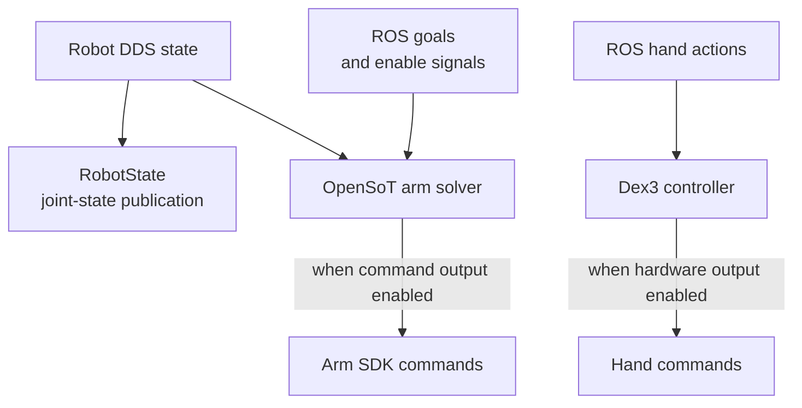

# G1Pilot bring-up

G1Pilot connects ROS state and task interfaces to Unitree DDS. Its state, arm and hand paths have separate ownership and launch settings.

## Follow the code

| Diagram component | Code entry point | Responsibility |
|---|---|---|
| Body state | [robot_state.py](https://github.com/sri299792458/g1pilot/blob/72acc803edefe583c24f53e76a21d8d4ed10ed14/g1pilot/state/robot_state.py#L118) · `RobotState.callback_lowstate` | Translate measured body state into the configured ROS representation. |
| Arm command path | [opensot_solver.py](https://github.com/sri299792458/g1pilot/blob/72acc803edefe583c24f53e76a21d8d4ed10ed14/g1pilot/manipulation/opensot_solver.py#L782) · `G1CollisionAvoidanceNode.control_loop` | Read goals/state and enforce the selected command/enable mode. |
| Hand interface setup | [dx3_hand.py](https://github.com/sri299792458/g1pilot/blob/72acc803edefe583c24f53e76a21d8d4ed10ed14/g1pilot/manipulation/dx3_hand.py#L99) · `DX3Controller.initialize_hand_interfaces` | Create the hand interfaces according to the resolved mode. |
| Hand command path | [dx3_hand.py](https://github.com/sri299792458/g1pilot/blob/72acc803edefe583c24f53e76a21d8d4ed10ed14/g1pilot/manipulation/dx3_hand.py#L183) · `DX3Controller.publish_commands` | Publish the selected hand actions only through initialized outputs. |

These links pin the June implementation. Follow the parent launch arguments through each child before assuming a dry-mode flag disables every publisher. The [July simulator](../simulation/mujoco.md) uses a later, separately pinned configuration. Neither path supplies the tabletop controller’s complete ownership lifecycle.

## Make offline mode real

Several components could still require or touch hardware when the parent
launch selected dry mode. A callback expected a robot object that did not
exist; Dex3 initialization ignored the setting; launch-time interface checks
ran before arguments were resolved. The fixes propagated the mode through the
launch graph and separated state observation from command publisher creation.

The lesson is to audit the entire launch path. A top-level `use_robot:=false`
flag is useful only if every child respects it. The documented offline launches
and mock checks establish software behavior, not physical balance or collision
performance.

## Environment work

The Docker/Jazzy work repaired Pinocchio/collision dependencies, Boost build
options, Livox flags, and Python ABI conflicts. NumPy 1.26.4, OpenCV below
4.12 and setuptools below 80 were retained with that environment. Globally
prepending cmeel libraries had caused a shutdown double-free; unused Python
Pinocchio quaternion helpers were replaced with SciPy Rotation.

The native Humble setup later separated administrator provisioning from each
member's workspace. Use its recorded script and environment rather than
collecting individual pip installs from different stages of the log.

## Topics and transforms

Individually running nodes still disagreed on goal topics, hand action strings,
arm enable/home commands, joint array lengths and joystick button semantics.
Aligning those interfaces was necessary before higher-level behavior could
work.

TF had similar ownership problems. Live IMU attitude was incorrectly represented
as sensor motion relative to the pelvis. Fixed sensor transforms belong to the
URDF; body pose belongs to the selected state-estimation/visualization owner.
Competing pelvis publishers or duplicate fixed transforms can produce plausible
but inconsistent RViz scenes.

The live LiDAR check recorded numeric TF and LiDAR/TF messages. It did not
complete the visual floor/wall check or establish end-to-end MOLA correctness.
The configured MOLA path also ignored the LiDAR pose from TF, so a corrected
URDF alone could not certify localization.

## Commands and failure behavior

The early OpenSoT emergency branch was unreachable because an outer condition
excluded emergency states. Its repair was scoped to arm motors 15–28; it did
not cover the legs, waist or Dex3. The later [PC2 recovery system](ownership.md)
is a separate development.

Other fixes stopped publishing autonomous commands while disabled, prevented
the mux from replaying old commands forever, and added a 0.25-second freshness
limit. That mux limit does not replace a low-level locomotion watchdog.

Navigation changes preserved unknown map cells and removed the straight-line
fallback after planning failure. Remaining diagonal-corner and smoothed-path
collision limitations were explicitly recorded. An empty path was a more
truthful result than an apparently successful route through unknown space.

## A useful rejected code fix

A static review proposed multiplying the OpenSoT solution by the control period.
The upstream contract showed that it was already a per-step increment.
Multiplying again would have changed the meaning. This is a compact example
of why understanding the library contract mattered more than producing a
plausible patch.

The July [MuJoCo backend](../simulation/mujoco.md) builds on this integration
history. The later tabletop executor intentionally avoids importing G1Pilot's
Cartesian OpenSoT runtime into a discrete move/settle/capture task.

Evidence: the June implementation linked above and the author's retained
bring-up observations, summarized in this chapter.

## Checks and evidence to inspect

Inspect the pinned launch graph and the state/arm/hand entry points above when
changing a mode or interface. The source record contains 38 issue dispositions
and mixed mock, offline and physical checks; those counts do not establish
complete autonomous navigation. Corrected topics or TF alone are insufficient.
