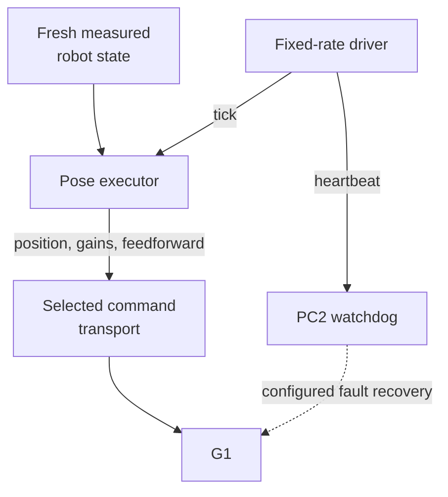

# Ownership and safety

Control ownership determines who may send commands and which controller supports the body. Read the measured-state, command and recovery paths separately.

## Follow the code

| Diagram component | Code entry point | Responsibility |
|---|---|---|
| Fixed-rate driver | [executor_driver.py](https://github.com/sri299792458/g1-dex3-tabletop/blob/cf1b27704c82d877d23ff5a3c157df3218f02402/src/g1_aprilcube_calibration/executor_driver.py#L187) · `ExecutorControlDriver._run` | Keep ticking and surface faults independently of planning. |
| Pose executor | [executor_state_machine.py](https://github.com/sri299792458/g1-dex3-tabletop/blob/cf1b27704c82d877d23ff5a3c157df3218f02402/src/g1_aprilcube_calibration/executor_state_machine.py#L834) · `PoseExecutor.tick` | Validate state freshness and advance bounded commands. |
| Seated transport | [unitree_debug_lowcmd.py](https://github.com/sri299792458/g1-dex3-tabletop/blob/cf1b27704c82d877d23ff5a3c157df3218f02402/src/g1_aprilcube_calibration/transports/unitree_debug_lowcmd.py#L236) · `UnitreeDebugLowCmdTransport.send_command` | Release AI under a guarded transition and send complete body commands. |
| Standing transport | [unitree_arm_sdk.py](../reference/code-index.md#code-arm-sdk) · `UnitreeArmSDKTransport.send_command` (local snapshot) | Use arm-SDK blend ownership, including the measured waist hold. |
| Independent recovery | [pc2_watchdog_agent.py](https://github.com/sri299792458/g1-dex3-tabletop/blob/cf1b27704c82d877d23ff5a3c157df3218f02402/src/g1_aprilcube_calibration/pc2_watchdog_agent.py#L343) · `run_watchdog` | Run on PC2; enforce the configured lease and terminal action. |

The selected transport changes the ownership contract. The diagram does not make seated `lowcmd` and standing `arm_sdk` interchangeable. Planning runs outside this loop; it submits a route to be checked and installed at an exact command boundary.

## Three state concepts

| Concept | Meaning on the recorded robot |
|---|---|
| Motion service `ai` | Normal Unitree high-level controller is available |
| No active motion service | Direct debug lowcmd ownership is available |
| Locomotion FSM | 0 zero torque; 1 Damp; 3 seated; 4 Ready |
| LowState `mode_machine=5` | Machine/message layout, not locomotion state |

Restoring `ai` does not select seated or Damp. A service response and an FSM
read-back establish different facts. While `ai` is released, the wireless
remote may have no high-level controller to receive its state requests.

## Standing and seated control

| | Standing calibration | Seated manipulation |
|---|---|---|
| Entry | Ready, FSM 4 | Seated, FSM 3, arms supported |
| Command channel | `rt/arm_sdk` | `rt/lowcmd` |
| Ownership | Firmware blend via slot 29 | Release motion service, own complete body |
| Body handling | Measured waist hold and arm commands | Complete measured 29-joint position hold |
| Normal end | Certified return, arm weight zero | Supported return, restore AI, verify 0 → 1 → 3 |
| Fault fallback | PC2 requests verified Damp | PC2 restores AI and verifies zero torque |

These paths cannot be substituted for each other. A successful seated takeover
does not test standing firmware blend behavior. The initial MuJoCo backend
does not implement either complete lifecycle.

## Startup order is a safety property

The standing watchdog regression is especially instructive. Three SDK publisher
initializations each slept about 0.2 seconds. Starting the 0.5-second PC2
heartbeat lease first guaranteed a long enough gap for recovery to begin.

The retained bag showed hand timeout packets before acquisition, then a leg
torque collapse, then elbow movement. The visible elbow error was downstream
of safety recovery. Raising the acquisition allowance would have hidden the
wrong symptom.

The corrected sequence constructs inert DDS endpoints first, then arms PC2,
then sends the first commands after fresh-state checks. For seated takeover,
a separate keepalive covers the blocking motion-service release through the
first complete lowcmd write. A watchdog armed too early or with a gap in its
coverage is not independent protection.

## Command continuity and measured state

Acquisition seeds commands from fresh measured joints. Later planning boundaries
have two simultaneous truths:

- measured body/finger state defines the current collision scene;
- the exact command already being published defines the next command boundary.

Substituting the measured arm vector for the active command at an arm switch
caused a 0.020277314 rad discontinuity. The executor rejected it. Shared
command-bound snapshot and plan-installation helpers preserve both held arm
commands while retaining measured body geometry.

The exact trajectory join is intentionally much tighter than physical tracking
error. Float32 roundoff is repaired only after proving it is numerical and
anchoring sample zero to the serialized command. A real displacement is never
made acceptable by widening that numerical threshold.

## Timing, gravity and process boundaries

The recorded controller runs at 250 Hz. Motion increments use the fixed 4 ms
period, preventing a late tick from issuing a larger catch-up step. The focused
configuration uses 100 ms state freshness, a 250 ms local control-gap fault,
and a separate 500 ms PC2 heartbeat timeout. These are implementation settings,
not formal guarantees for general-purpose Linux.

Arm gravity feedforward follows the pinned Unitree XR Pinocchio/RNEA approach.
It reduced drift in a physical zero-motion seated test to 0.008317 rad.
It does not make measured joints equal command targets or identify exact
hardware masses and friction.

Heavy planning runs in a separate process. So do PNG/session commits and raw
MCAP writing. A Python thread did not isolate control from a 12.3 MB JSON
serialization/hashing operation: measured interpreter stalls reached roughly
76–90 ms. The worker now constructs and hashes the full calibration request;
the control process sends a small snapshot and file/hash references.

## Finish control before tearing down resources

Camera/ROS and planner shutdown once happened before seated handback. The
control thread and local callbacks paused for about 209 ms while the independent
bag still saw healthy LowState traffic. Cleanup now resolves robot ownership
first, then destroys those resources, then finalizes recording.

Evidence: prototype control/recovery report; tabletop August 14–15 and September
4–5 logs. See [runbook](runbook.md) and [debugging](../reference/debugging.md).

## Checks and evidence to inspect

[test_executor_state_machine.py](https://github.com/sri299792458/g1-dex3-tabletop/blob/cf1b27704c82d877d23ff5a3c157df3218f02402/tests/test_executor_state_machine.py) covers executor transitions. [test_standing_calibration_control.py](../reference/code-index.md#code-test-standing) (local snapshot) includes publisher/startup and recovery ordering. These are source tests to read, not tests rerun here. The startup and cleanup failures below explain why ordering matters; see the [runbook](runbook.md) before operating hardware.
