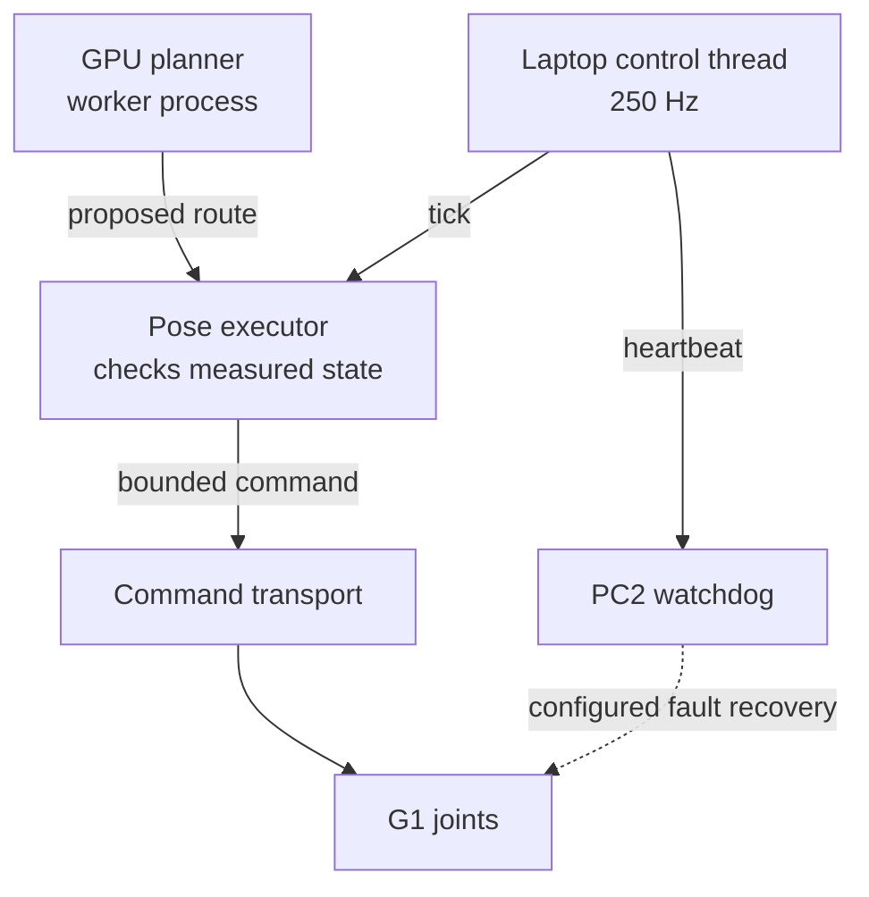

# Ownership and safety

Running a manipulation task transfers responsibility for joint commands from
the robot's normal controller to the research program, then back again. The
program must keep the body and hands controlled while perception and planning
run, and complete that handoff even when the task cannot continue.

This chapter traces those responsibilities through the implementation. Start
with the seated path below; standing calibration uses a different ownership
mechanism. The [runbook](runbook.md) covers operator preparation and recovery.

## Source versions

The seated demo baseline is [`main`](https://github.com/sri299792458/g1-dex3-tabletop/tree/7400aff201c2f73ef2a64e546d72bd66cbe87fd6).
This chapter also explains subsequent standing-control and shared-runtime fixes.
The later [task coordinator](../reference/code-index.md#code-tabletop) and
[executor](../reference/code-index.md#code-executor) entries pin the September
branch; their [demo coordinator](../reference/code-index.md#code-demo-tabletop)
and [demo executor](../reference/code-index.md#code-demo-executor) counterparts
remain available for comparison. September's final standing lifecycle has only
offline validation.

## Follow the code

| Diagram component | Code entry point | Responsibility |
|---|---|---|
| Task coordinator | [hardware_tabletop.py](https://github.com/sri299792458/g1-dex3-tabletop/blob/59c21b1388c636176dea67ea7ed3e253f8510783/src/g1_dex3_tabletop/hardware_tabletop.py) · `run_tabletop`, `_restore_seated_control` (September branch) | Order preview, recording, acquisition, task execution and handback. |
| Fixed-rate driver | [executor_driver.py](https://github.com/sri299792458/g1-dex3-tabletop/blob/7400aff201c2f73ef2a64e546d72bd66cbe87fd6/src/g1_aprilcube_calibration/executor_driver.py#L187) · `ExecutorControlDriver._run` | Keep ticking and surface faults independently of planning. |
| Acquisition and execution | [executor_state_machine.py](https://github.com/sri299792458/g1-dex3-tabletop/blob/59c21b1388c636176dea67ea7ed3e253f8510783/src/g1_aprilcube_calibration/executor_state_machine.py#L248) · `PoseExecutor.acquire`, `tick` | Seed acquisition from fresh measurements, then validate state and advance bounded commands. |
| Seated transport | [unitree_debug_lowcmd.py](https://github.com/sri299792458/g1-dex3-tabletop/blob/7400aff201c2f73ef2a64e546d72bd66cbe87fd6/src/g1_aprilcube_calibration/transports/unitree_debug_lowcmd.py#L236) · `UnitreeDebugLowCmdTransport.send_command` | Release AI under a guarded transition and send complete body commands. |
| Standing transport | [unitree_arm_sdk.py](https://github.com/sri299792458/g1-dex3-tabletop/blob/59c21b1388c636176dea67ea7ed3e253f8510783/src/g1_aprilcube_calibration/transports/unitree_arm_sdk.py) · `UnitreeArmSDKTransport.send_command` (September branch) | Use arm-SDK blend ownership, including the measured waist hold. |
| Laptop watchdog client | [pc2_safety.py](https://github.com/sri299792458/g1-dex3-tabletop/blob/7400aff201c2f73ef2a64e546d72bd66cbe87fd6/src/g1_aprilcube_calibration/pc2_safety.py#L123) · `PC2DampingWatchdog.start`, `restore_seated`, `restore_zero_torque` | Start the remote agent, send heartbeats and require explicit recovery acknowledgements. |
| PC2 watchdog agent | [pc2_watchdog_agent.py](https://github.com/sri299792458/g1-dex3-tabletop/blob/7400aff201c2f73ef2a64e546d72bd66cbe87fd6/src/g1_aprilcube_calibration/pc2_watchdog_agent.py#L343) · `run_watchdog` | Enforce the heartbeat deadline on the robot and verify the requested terminal state. |

The GPU worker supplies a proposed route. The control side checks and installs
it at an exact command boundary; the worker does not publish motor commands.
See [planning contracts](../manipulation/planning.md) for that interface.

## Three state concepts

Keep three questions separate: which motion service is active, which locomotion
state that service has entered, and which message layout the robot uses.
`ai` below is the Unitree motion-service name.

| Concept | Meaning on the recorded robot |
|---|---|
| Motion service `ai` | Normal Unitree high-level controller is available |
| No active motion service | Direct debug lowcmd ownership is available |
| Locomotion FSM | 0 zero torque; 1 Damp; 3 seated; 4 Ready |
| LowState `mode_machine=5` | Machine/message layout, not locomotion state |

Restoring `ai` does not select seated or Damp. A service response and an FSM
read-back establish different facts. While `ai` is released, the wireless
remote may have no high-level controller to receive its state requests. This
explains why a connected robot can appear unresponsive to the remote during
direct control; see [the recovery explanation](runbook.md#if-the-remote-appears-unresponsive).

## Standing and seated control

| | Standing calibration | Seated manipulation |
|---|---|---|
| Entry | Ready, FSM 4 | Seated, FSM 3, arms supported |
| Command channel | `rt/arm_sdk` | `rt/lowcmd` |
| Ownership | Firmware blend via slot 29 | Release motion service, own complete body |
| Body handling | Measured waist hold and arm commands | Complete measured 29-joint position hold |
| Normal end | Certified return, arm weight zero | Supported return, restore AI, verify 0 → 1 → 3 |
| Fault fallback | PC2 requests verified Damp | PC2 restores AI and verifies zero torque |

These paths cannot be substituted for each other. A successful seated takeover
does not test standing firmware blend behavior. The initial MuJoCo backend
does not implement either complete lifecycle.

## Walkthrough: acquiring seated control

Follow `run_tabletop` into `PoseExecutor.acquire` and the lowcmd transport.
The important boundary is the first motor command, which also initiates the
guarded release of the existing motion service.

1. **Observe and prepare.** The preview checks stationary seated state, both
   hands, camera configuration and the cube. GPU warmup can run here without
   creating command publishers. SPACE advances the workflow; the coordinator
   then checks that the selected configurations and artifacts have not changed.
2. **Record before taking control.** The raw recorder starts before command
   publisher creation. A new activation observation checks the robot again;
   a valid earlier preview is insufficient if the robot has since moved.
3. **Construct the inactive command endpoints.** The body and hand publishers
   are initialized before the PC2 heartbeat deadline starts. Construction is
   separate from publishing a command in these adapters.
4. **Arm recovery and hold the hands.** The PC2 agent checks the required seated
   FSM and begins its lease. The hand controller acquires a measured hold while
   maintaining heartbeats. The fixed-rate driver then starts; its heartbeat
   callback also maintains the hand commands.
5. **Acquire from fresh measurements.** `PoseExecutor.acquire` seeds both arm
   commands from the current measured joints. The first transport send checks
   that the arm target is sufficiently close to its measurement and seeds all
   29 body-joint slots. It releases the active motion service, verifies that
   the service is gone, and writes the complete lowcmd packet. A temporary
   keepalive covers the blocking release through that first write.
6. **Observe the loaded hold before moving.** The executor monitors acquisition
   drift while its ramp completes. The task waits for `READY`, then takes the
   loaded observation used to plan the supported escape. Every subsequent
   arm command still carries the held body state; hand commands have their own
   controller and topics.

The temporary takeover keepalive exists to cover a bounded blocking operation.
During ordinary execution, heartbeat progress is coupled to the control driver.
Keeping an unrelated heartbeat thread alive after the executor has failed would
hide the failure from PC2.

## Startup order is a safety property

The standing example here comes from the later September investigation.

The standing watchdog regression is especially instructive. Three SDK publisher
initializations each slept about 0.2 seconds. Starting the 0.5-second PC2
heartbeat lease first guaranteed a long enough gap for recovery to begin.

The retained bag showed hand timeout packets before acquisition, then a leg
torque collapse, then elbow movement. The visible elbow error was downstream
of safety recovery. Raising the acquisition allowance would have hidden the
wrong symptom.

The corrected sequence constructs inert DDS endpoints first, then arms PC2,
then sends the first commands after fresh-state checks. For seated takeover,
a separate keepalive covers the blocking motion-service release through the
first complete lowcmd write. A watchdog armed too early or with a gap in its
coverage is not independent protection.

## What keeps running while planning

A stationary hold is active control: the executor continues checking measured
state and publishing commands while the task waits for the GPU worker, an image
or the next phase. `ExecutorControlDriver._run` ticks the executor first. If
the executor reports `FAULT`, the driver records the failure and stops sending
heartbeats. The PC2 agent can then request recovery even if the laptop task
cannot complete its own exception handling.

The watchdog client on the laptop and the agent on PC2 are separate pieces.
The agent watches the arrival of heartbeats over its SSH channel; timeout or
channel closure triggers the configured recovery. It does not independently
check the planned path, scene geometry or joint tracking. Those checks belong
to the planner/executor, whose progress must govern the heartbeat.

| Check or cadence | Recorded setting | Purpose |
|---|---|---|
| Control tick | 250 Hz; nominal 4 ms motion increment | Continue holding or advancing the command independently of task planning |
| Measured-state age | 100 ms maximum | Reject a stale local observation even if commands could still be published |
| Local control gap | Fault above 250 ms | Detect a prolonged gap between executor ticks |
| PC2 heartbeat | Sent at 100 ms intervals; 500 ms timeout | Initiate recovery when the control process stops maintaining the lease |

These are separate checks on different signals. A 500 ms PC2 timeout does not
permit the controller to use 500 ms-old joint state. Late ticks use the nominal
4 ms motion increment, preventing a larger catch-up step. These settings are
implementation limits on general-purpose Linux, not a hard real-time guarantee.

## Command continuity and measured state

Acquisition seeds commands from fresh measured joints. Later planning boundaries
have two simultaneous truths:

- measured body/finger state defines the current collision scene;
- the exact command already being published defines the next command boundary.

For example, after moving the left arm, the right elbow can sit slightly away
from the position still being commanded to it. Planning the next right-arm
route from that measurement makes sample zero jump away from the current
command. In `stack_20260821T112912Z`, the difference was 0.020277314 rad and
the executor rejected the route before right-arm motion. The correction kept
both exact held arm commands in the planning boundary while retaining measured
body and finger geometry. The retained request then passed offline CuRobo
planning with zero start-to-command error; that replay was not a new robot trial.

The exact trajectory join is intentionally much tighter than physical tracking
error. Float32 roundoff is repaired only after proving it is numerical and
anchoring sample zero to the serialized command. A real displacement is never
made acceptable by widening that numerical threshold.

## Timing, gravity and process boundaries

Arm gravity feedforward follows the pinned Unitree XR Pinocchio/RNEA approach.
It reduced drift in a physical zero-motion seated test to 0.008317 rad.
It does not make measured joints equal command targets or identify exact
hardware masses and friction.

Heavy planning runs in a separate process. So do PNG/session commits and raw
MCAP writing. A Python thread did not isolate control from a 12.3 MB JSON
serialization/hashing operation: measured interpreter stalls reached roughly
76–90 ms. In the September implementation, the worker constructs and hashes the full calibration request;
the control process sends a small snapshot and file/hash references.

## A rejected task and a control fault need different returns

An expected task failure can occur while the robot is still under healthy
control. A cube may become occluded at a known clearance pose, for example.
The task can use its already validated reverse route if the controller and
the required return conditions remain valid. A control fault removes that
basis for continuing the planned motion.

| Situation | Seated workflow response | Evidence required before considering control returned |
|---|---|---|
| Task completes | Execute the checked return to support, restore initial fingers at the prescribed point, then request normal handback | PC2 acknowledgement of restored `ai` and seated FSM 3 |
| Expected task rejection with healthy control and a valid return | Follow the applicable frozen recovery route, then use normal handback | Checked return completed and the same seated acknowledgement |
| Stale state, control/transport/watchdog fault, or unexpected failure | Request PC2 zero-torque recovery; heartbeat loss also triggers that configured fallback | PC2 acknowledgement of restored `ai`, body FSM 0 and the hand timeout action |
| Recovery acknowledgement missing | Preserve the failure and cleanup details; ownership remains unconfirmed | A process exit or an attempted service call does not establish the terminal state |

The distinction was earned on hardware. In `stack_20260821T164205Z`, a finger
occluded the primary cube after a valid escape to clearance. Treating the
perception exception as a generic failure invoked zero-torque cleanup. The
later checkpoint included in the September branch first checks driver health, then classifies the expected
perception rejection so it can restore the hands and reverse the supported
escape. Unexpected failures still take the fault path. Converting every
exception into `TabletopTaskRejected` would remove that distinction.

The precise reverse depends on the phase. A failed low retention lift returns
to support while keeping the hand closed, then opens there; it cannot use an
arbitrary straight retreat. [Pickup and stacking](../manipulation/tasks.md)
describes those phase-specific routes.

## Finish control before tearing down resources

On the healthy seated handback path, `_restore_seated_control` stops and checks
the driver, times out the hand commands, and asks PC2 to restore seated control.
PC2 restores `ai` and checks the locomotion FSM. The usual restoration follows
0 → Damp 1 → Seated 3; the helper also handles an already verified Damp or
seated state without unnecessarily repeating the earlier transitions.
Only its successful acknowledgement permits the executor to confirm external
takeover and close the body transport.

Camera/ROS and planner shutdown once happened before seated handback. The
control thread and local callbacks paused for about 209 ms while the independent
bag still saw healthy LowState traffic. The retained run was
`tabletop_20260815T162444Z`: the independent stream's largest LowState gap was
only 18.5 ms. This located the interruption in local teardown rather than a
robot/network outage. Cleanup now attempts ownership handback before resource
shutdown, and the ROS teardown guard refuses to proceed while direct control
still requires takeover. Recording finalization follows the recovery attempt,
so its artifacts can retain both the original failure and cleanup errors.

Read task outcome, terminal action and `cleanup_errors` together. In retained
stack sessions, an episode may finish while control is deliberately held for
the next episode; see [recording boundaries](../data/recording.md).

Evidence: prototype control/recovery report; tabletop August 14–15 and September
4–5 logs. See [runbook](runbook.md) and [debugging](../reference/debugging.md).

## Checks and evidence to inspect

When changing this pipeline, follow the invariant into both its implementation
and its regression check. In
[test_executor_state_machine.py](https://github.com/sri299792458/g1-dex3-tabletop/blob/59c21b1388c636176dea67ea7ed3e253f8510783/tests/test_executor_state_machine.py),
start with these specific examples:

| Proposed change | Regression to read |
|---|---|
| Change acquisition state or ramp | `test_acquisition_uses_fresh_seed_and_reports_takeover_drift` |
| Replace a route at a loaded boundary | `test_loaded_handoff_can_install_plan_without_rebasing_dual_arm_command` |
| Switch which arm is moving | `test_arm_plan_switch_rejects_a_changed_boundary_command` |
| Change tick scheduling | `test_nonfaulting_scheduler_gap_uses_nominal_motion_step`, `test_control_gap_at_hard_limit_still_faults` |

[test_standing_calibration_control.py](https://github.com/sri299792458/g1-dex3-tabletop/blob/59c21b1388c636176dea67ea7ed3e253f8510783/tests/test_standing_calibration_control.py)
(September branch) covers the separate standing startup and recovery order.
These are source tests to inspect. Selected offline regressions were rerun during
publication; [their scope](../reference/sources.md#what-was-checked) is separate
from physical commissioning.
Keep the physical observations above distinct from offline regressions and
use the [runbook](runbook.md) before operating hardware.
