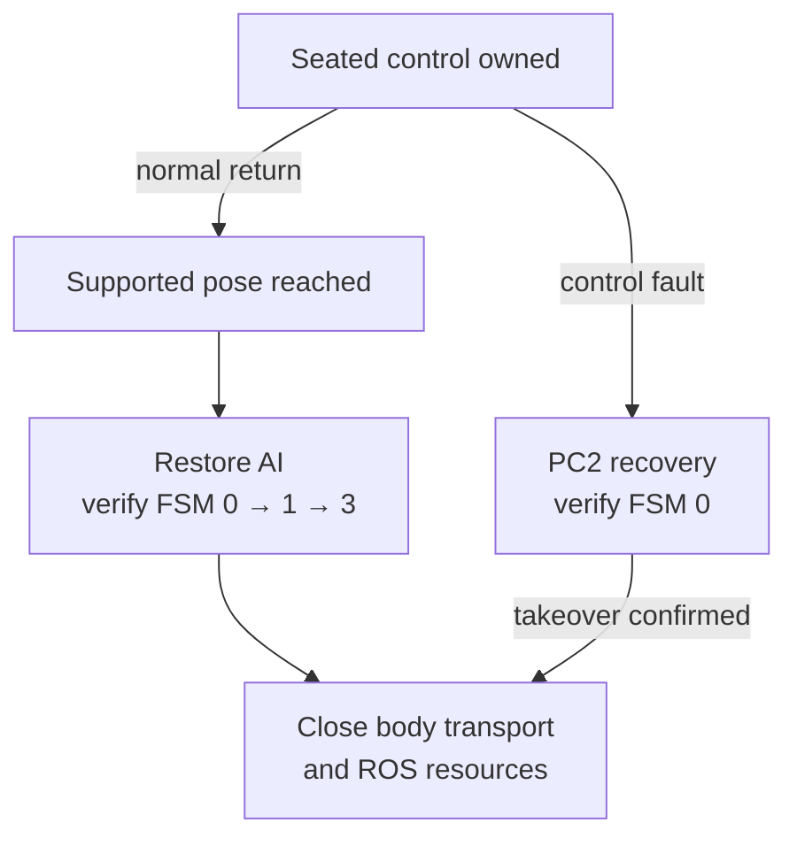

# Operating and recovering

A normal seated return and a seated control fault have different terminal states. This diagram describes the ownership branches; the preflight and recovery instructions below supply their conditions.



## Follow the code

| Diagram component | Code entry point | Responsibility |
|---|---|---|
| Normal return orchestration | [hardware_tabletop.py](../reference/code-index.md#code-tabletop) · `_restore_seated_control` (local snapshot) | Finish the seated handback before closing dependent resources. |
| Verified seated handback | [pc2_safety.py](https://github.com/sri299792458/g1-dex3-tabletop/blob/cf1b27704c82d877d23ff5a3c157df3218f02402/src/g1_aprilcube_calibration/pc2_safety.py#L283) · `PC2DampingWatchdog.restore_seated` | Require the PC2 seated acknowledgement. |
| Seated fault recovery | [pc2_safety.py](https://github.com/sri299792458/g1-dex3-tabletop/blob/cf1b27704c82d877d23ff5a3c157df3218f02402/src/g1_aprilcube_calibration/pc2_safety.py#L302) · `PC2DampingWatchdog.restore_zero_torque` | Require the PC2 zero-torque acknowledgement; do not substitute the clean seated path. |
| Standing release | [control.py](../reference/code-index.md#code-calibration-control) · `StandingCalibrationControl.release` (local snapshot) | Separate arm-SDK lifecycle with a validated shoulder return. |

The terminal state must be observed, not inferred from a process exiting or a service request returning. Standing calibration has its own release and Damp fallback; use the [ownership comparison](ownership.md#standing-and-seated-control).

## Before motion

1. Identify the source version, hardware profile, camera profile and selected
   calibration bundle. Record local changes, not just Git HEAD.
2. Confirm the load-bearing harness, physical arm support, clear sweep,
   camera witness mark, and installed hand/marker geometry.
3. Start with inspection. Verify fresh measured body and both hand states,
   the correct FSM, camera frames and CameraInfo, and no competing command owner.
4. Verify the PC2 watchdog installation and normal recovery path for the chosen
   standing or seated mode. A healthy Ethernet ping alone does not establish this.
5. Check storage and the recording subscription contract. Planner warmup during
   preview is command-free; it does not approve a task from stale preflight data.
6. Read the preview and exact acknowledgement. SPACE gates command creation.
   If a prerequisite fails, preserve the retained request and reason.

The source's typed acknowledgement is deliberately explicit:

```text
I CONFIRM THE G1 IS SECURED BY THE LOAD-BEARING HARNESS AND THE WORKSPACE IS CLEAR
```

The task lifecycle and configuration are described in
[pickup and stacking](../manipulation/tasks.md) and
[calibration](../calibration/workflow.md). Use the matching source revision's
launcher and argument documentation; none was executed while writing this guide.

## What a normal seated run does

It acquires the complete measured body, holds the unused arm and fingers,
freezes a supported escape and its exact reverse, and moves to clearance.
It observes the scene again after the load changes. Only then does it select
and install task motion.

A healthy task rejection uses the appropriate frozen reverse: at clearance,
reverse the escape; after a failed low retention lift, lower while closed,
open at support, retreat and return. The hand's arbitrary initial posture is
restored before supported return.

At normal final handback, PC2 restores AI and verifies FSM 0 → Damp 1 →
Seated 3 before the lowcmd publisher closes. Fault recovery stops at verified
zero torque instead of automatically continuing that normal seating sequence.

## Keys have context

| Context | Requested action |
|---|---|
| Bilateral calibration preview, Q | Latch a graceful finish at the next identical anchor, then checked return |
| Bilateral calibration, Ctrl+C | Damp recovery |
| Stack waiting between retained-control episodes, Ctrl+C | Clean seated handback and exit |
| Stack during observation, planning or motion, Ctrl+C | Fault cleanup to zero torque |
| Hardware preview, SPACE | Continue only after immutable inputs and readiness checks |

A frozen preview window is not itself proof of a robot failure. One calibration
Q run completed its return while HighGUI events stopped being serviced. The UI
fix closes the preview and reports the remaining return in the terminal.

## If the remote appears unresponsive

Do not assume the radio or network failed. Direct lowcmd deliberately releases
the service that normally consumes remote requests. Inspect retained cleanup
status to determine whether AI restoration and terminal FSM were verified.

The prototype's `docs/g1_control_state_and_recovery.md` contains the
operator-only raw-SDK recovery procedure and its commissioning history.
Use that exact source with a trained operator and physical support; this guide
does not shorten it into an unqualified “restart AI” command. Restoring a
service can re-enable torque. A successful service call is not an FSM check,
and repeated calls after verified restoration are not useful.

## Inspect the outcome

Read `status.json`, the planner log, contact/retention evidence, and
`raw_episode/episode_manifest.json` together. Distinguish:

- task completed or rejected;
- control returned normally or required fault recovery;
- recording complete or incomplete;
- physical placement independently observed or unscored.

For retained-control stack sessions, one episode ending does not mean ownership
has been handed back; the process remains in its supported wait for the next
SPACE. Each episode still gets a separate run directory and bag.

Evidence: [source catalog](../reference/sources.md), prototype recovery report,
current tabletop README and dated lifecycle corrections.

## Checks and evidence to inspect

Trace `run_tabletop` cleanup and `StandingCalibrationControl.close` when changing resource shutdown. [test_standing_calibration_control.py](../reference/code-index.md#code-test-standing) (local snapshot) checks recovery-before-transport-close. Read the August 14–15 and September 4–5 control entries in the [source records](../reference/sources.md); do not perform fault injection merely to build these docs.
