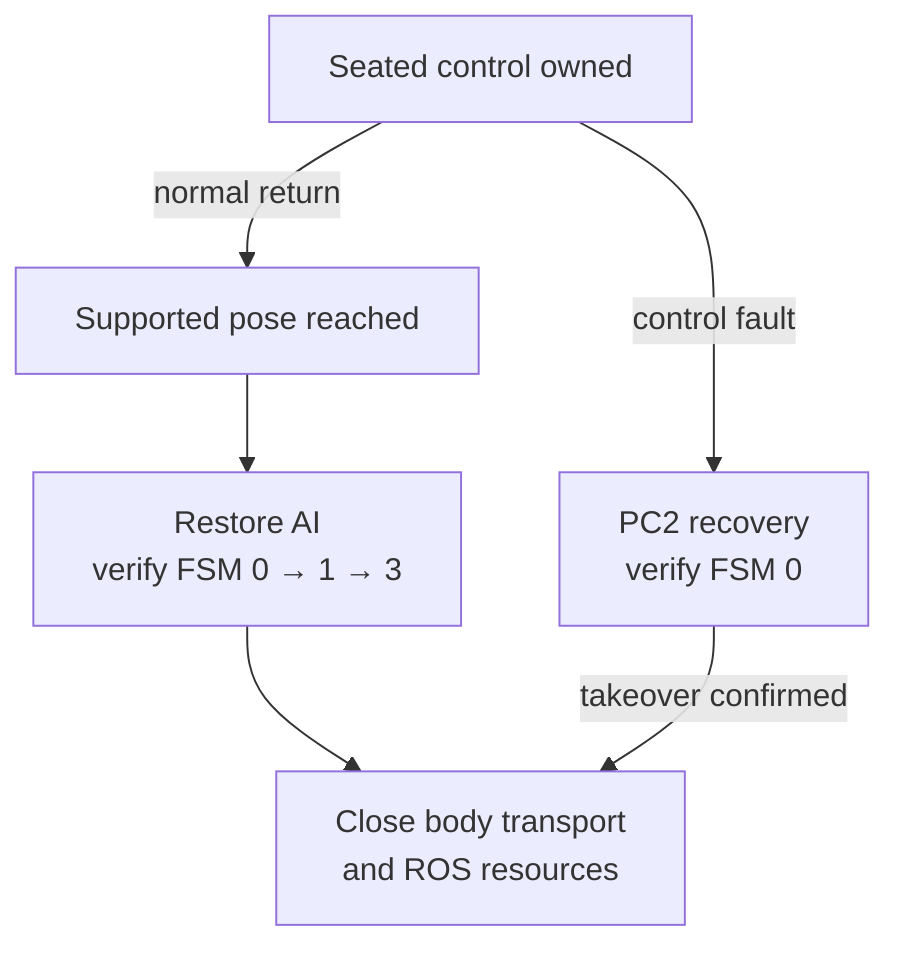

# Operating and recovering

Use this checklist before operating a supported tabletop task and when
interpreting its exit status. It assumes the robot and PC2 recovery path
have already been commissioned for the selected mode; [setup](../start/setup.md#prepare-pc2-recovery-separately-from-arming-it)
distinguishes runtime installation from an armed session. It does not replace
the [ownership design](ownership.md) or the source launcher instructions.

## Source scope

Use demo `main` for the August stacking workflow. The links marked September
show the later shared coordinator and standing lifecycle; the
[demo coordinator](../reference/code-index.md#code-demo-tabletop) is the baseline
reference. Keyboard and recovery behavior must match the selected checkout.

## Before motion

1. Identify the source version, hardware profile, camera profile and selected
   calibration bundle. Record local changes, not just Git HEAD.
2. Confirm the load-bearing harness, physical arm support, clear sweep,
   camera witness mark, and installed hand/marker geometry.
3. Start with inspection. Verify fresh measured body and both hand states,
   the correct FSM, camera frames and CameraInfo, and no competing command owner.
4. Verify the PC2 watchdog installation and normal recovery path for the chosen
   standing or seated mode. A healthy Ethernet ping alone does not establish this.
5. Check storage and the recording subscription contract. Planner warmup during
   preview is command-free; it does not approve a task from stale preflight data.
6. Read the preview and exact acknowledgement. SPACE gates command creation.
   If a prerequisite fails, preserve the retained request and reason.

The source's typed acknowledgement is deliberately explicit:

```text
I CONFIRM THE G1 IS SECURED BY THE LOAD-BEARING HARNESS AND THE WORKSPACE IS CLEAR
```

The [stacking example](../manipulation/tasks.md) records the demonstrated
configuration; the [calibration chapter](../calibration/workflow.md) describes
the separate experimental collector. Use the matching source revision's
launcher and argument documentation; none was executed while writing this guide.

## What a normal seated run does

It acquires the complete measured body, holds the unused arm and fingers,
freezes a supported escape and its exact reverse, and moves to clearance.
It observes the scene again after the load changes. Only then does it select
and install task motion.

A healthy task rejection uses the appropriate frozen reverse: at clearance,
reverse the escape; after a failed low retention lift, lower while closed,
open at support, retreat and return. The hand's arbitrary initial posture is
restored before supported return.

At normal final handback, PC2 restores AI and verifies FSM 0 → Damp 1 →
Seated 3 before the lowcmd publisher closes. Fault recovery stops at verified
zero torque instead of automatically continuing that normal seating sequence.

### Normal return and fault recovery take different paths

The arrows below describe the seated ownership lifecycle. A normal return
reaches support before handback; a control fault requests verified zero torque.
Closing a terminal or observing a service acknowledgement is not a substitute
for observing that terminal robot state.



## Keys have context

| Context | Requested action |
|---|---|
| Bilateral calibration preview, Q | Latch a graceful finish at the next identical anchor, then checked return |
| Bilateral calibration, Ctrl+C | Damp recovery |
| Stack waiting between retained-control episodes, Ctrl+C | Clean seated handback and exit |
| Stack during observation, planning or motion, Ctrl+C | Fault cleanup to zero torque |
| Hardware preview, SPACE | Continue only after immutable inputs and readiness checks |

A frozen preview window is not itself proof of a robot failure. One calibration
Q run completed its return while HighGUI events stopped being serviced. The UI
fix closes the preview and reports the remaining return in the terminal.

## If the remote appears unresponsive

Do not assume the radio or network failed. Direct lowcmd deliberately releases
the service that normally consumes remote requests. Inspect retained cleanup
status to determine whether AI restoration and terminal FSM were verified.

The prototype's [control-state and recovery guide](https://github.com/sri299792458/robot-calibration-aprilcube-prototype/blob/f295def18bd936031fba325d4e8bdfc71fea671a/docs/g1_control_state_and_recovery.md) contains the
operator-only raw-SDK recovery procedure and its commissioning history.
Use that exact source with a trained operator and physical support; this guide
does not shorten it into an unqualified “restart AI” command. Restoring a
service can re-enable torque. A successful service call is not an FSM check,
and repeated calls after verified restoration are not useful.

## Inspect the outcome

Read `status.json`, the planner log, contact/retention evidence, and
`raw_episode/episode_manifest.json` together. In the August tabletop path:

| Question | Field or artifact | Interpretation |
|---|---|---|
| What ended the task? | `status.json`: `status`, then `reason` or `error`/`error_type` when present | `completed`, `task_rejected` and `failed` describe different task paths |
| Did recovery itself fail? | `status.json`: `cleanup_errors`, plus terminal-action/return evidence for the relevant path | Inspect each cleanup stage independently of the primary task error |
| Did this process command motion? | `status.json`: `commands_robot` | A failed preview can exit before commands exist |
| Is the raw recording complete? | Manifest: `capture.complete`, `capture.problems`, `capture.recorder_exit_code` and `recorded_topics` | Require the writer audit, expected types and nonempty required streams |
| Was physical placement successful? | RGB or external footage tied to this run, with an explicit annotation | Program completion alone is not an independently scored placement |

Field names and outcome structure vary between coordinators and revisions;
use the matching source when parsing them. Preserve the first error as well as
later cleanup errors. [Debugging from evidence](../reference/debugging.md#worked-example-a-cleanup-stall)
shows why their order matters.

For retained-control stack sessions, one episode ending does not mean ownership
has been handed back; the process remains in its supported wait for the next
SPACE. Each episode still gets a separate run directory and bag.

After final handback, [release the ROS camera](../hardware/camera.md#inspect-acquire-and-release-the-camera)
when it is no longer needed. Robot handback and camera-service restoration are
separate lifecycle steps.

Evidence: [source catalog](../reference/sources.md), prototype recovery report,
current tabletop README and dated lifecycle corrections.

## Follow the code

| Implementation concern | Code entry point | Responsibility |
|---|---|---|
| Normal return orchestration | [hardware_tabletop.py](https://github.com/sri299792458/g1-dex3-tabletop/blob/59c21b1388c636176dea67ea7ed3e253f8510783/src/g1_dex3_tabletop/hardware_tabletop.py) · `_restore_seated_control` (September branch) | Finish the seated handback before closing dependent resources. |
| Verified seated handback | [pc2_safety.py](https://github.com/sri299792458/g1-dex3-tabletop/blob/7400aff201c2f73ef2a64e546d72bd66cbe87fd6/src/g1_aprilcube_calibration/pc2_safety.py#L283) · `PC2DampingWatchdog.restore_seated` | Require the PC2 seated acknowledgement. |
| Seated fault recovery | [pc2_safety.py](https://github.com/sri299792458/g1-dex3-tabletop/blob/7400aff201c2f73ef2a64e546d72bd66cbe87fd6/src/g1_aprilcube_calibration/pc2_safety.py#L302) · `PC2DampingWatchdog.restore_zero_torque` | Require the PC2 zero-torque acknowledgement; do not substitute the clean seated path. |
| Standing release | [control.py](https://github.com/sri299792458/g1-dex3-tabletop/blob/59c21b1388c636176dea67ea7ed3e253f8510783/src/g1_dex3_tabletop/calibration/control.py) · `StandingCalibrationControl.release` (September branch) | Separate arm-SDK lifecycle with a validated shoulder return. |

The terminal state must be observed, not inferred from a process exiting or a service request returning. Standing calibration has its own release and Damp fallback; use the [ownership comparison](ownership.md#standing-and-seated-control).

## Checks and evidence to inspect

Trace `run_tabletop` cleanup and `StandingCalibrationControl.close` when changing resource shutdown. [test_standing_calibration_control.py](https://github.com/sri299792458/g1-dex3-tabletop/blob/59c21b1388c636176dea67ea7ed3e253f8510783/tests/test_standing_calibration_control.py) (September branch) checks recovery-before-transport-close. The [ownership chapter](ownership.md) explains the observed acquisition and cleanup failures that motivated this ordering.
