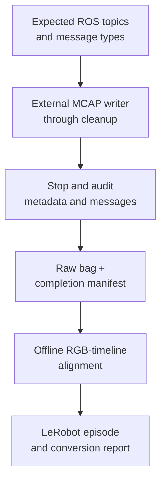

# Recording the G1 and exporting LeRobot

The G1 recorder preserves raw evidence through ownership cleanup; the LeRobot converter derives a lower-rate training representation afterward. Recording completeness and task success are separate outcomes.

## Follow the code

| Diagram component | Code entry point | Responsibility |
|---|---|---|
| Topic contract | [raw_episode_recording.py](../reference/code-index.md#code-recorder) · `tabletop_raw_topics` (local snapshot) | Choose the expected streams for the recording profile. |
| Writer startup | [raw_episode_recording.py](../reference/code-index.md#code-recorder) · `RawEpisodeRecorder.start` (local snapshot) | Require the recorder to subscribe before continuing. |
| Completion audit | [raw_episode_recording.py](../reference/code-index.md#code-recorder) · `RawEpisodeRecorder.stop` (local snapshot) | Check exit, MCAP metadata, message types and required nonempty streams. |
| Offline alignment | [lerobot_conversion.py](https://github.com/sri299792458/g1-dex3-tabletop/blob/cf1b27704c82d877d23ff5a3c157df3218f02402/src/g1_dex3_tabletop/lerobot_conversion.py#L259) · `index_and_align_episode` | Select state and active commands relative to actual RGB samples. |
| Numeric representation | [lerobot_conversion.py](https://github.com/sri299792458/g1-dex3-tabletop/blob/cf1b27704c82d877d23ff5a3c157df3218f02402/src/g1_dex3_tabletop/lerobot_conversion.py#L573) · `build_numeric_frame` | Construct the named joint, command, pressure and IMU arrays. |
| Dataset export | [lerobot_conversion.py](https://github.com/sri299792458/g1-dex3-tabletop/blob/cf1b27704c82d877d23ff5a3c157df3218f02402/src/g1_dex3_tabletop/lerobot_conversion.py#L774) · `convert_episode` | Write the derived episode and its conversion evidence. |

A complete bag can contain a failed task or abnormal cleanup. An incomplete bag remains available as evidence but must not be relabelled complete because conversion or video playback works. Preserve the original bag when using the derived dataset.

## Record the full lifecycle

The current full contract contains 14 topics:

| Streams | Count | Why retain them |
|---|---:|---|
| Body LowState, secondary IMU | 2 | Measured body and torso state |
| Body command: lowcmd or arm_sdk | 1 | Actual command intent and gains |
| Left/right hand state and command | 4 | Measured fingers, pressure and commanded close |
| RGB image and CameraInfo | 2 | Original visual evidence and projection model |
| Native depth and CameraInfo | 2 | Original depth evidence and geometry |
| Camera gyro, accelerometer, static TF | 3 | Camera motion and sensor relationships |

ROS topic names and the Unitree `rt` DDS partition are separate naming layers.
The recorder must verify expected message types and nonempty subscriptions;
an apparently valid bag that contains only camera topics is not a robot episode.

Recording starts before command ownership and continues through return/fault
cleanup. The tabletop episode begins after SPACE; the later standing profile
records before its motion authorization boundary. Retained stack sessions
produce a separate bag for each task while keeping the control process alive.
The six-topic September 5 standing bag predates full camera recording, so its
failed views cannot be reconstructed afterward.

## Keep writing away from control

An external writer stores uncompressed MCAP. Per-task JSON records interpretation,
phase and outcomes separately. PNG encoding, JSON serialization and filesystem
sync previously interrupted control and were moved out of its process.

Camera/ROS resources shut down only after robot ownership is resolved. The
recorder then receives SIGINT and must finish with successful exit, metadata
and its message contract intact. An incomplete bag remains marked incomplete;
a directory existing on disk is not enough.

RGB at 1280 × 720 × 15 Hz uses about 39.86 MiB/s before overhead. Native depth
adds about 8.9 MiB/s, giving roughly 2.9 GiB/min for these streams. Nine synthetic
15 s trials observed control gaps below 10 ms, which is useful load testing
but not a hard timing guarantee for hardware operation.

The skip-camera profile removes four image/CameraInfo topics while retaining
gyro, acceleration and static TF. Perception may still run. Use it only when
the missing image evidence is an intentional recording choice.

## Time and completeness

MCAP receipt, ROS headers and sensor ticks are not the same clock and do not
automatically identify exposure time. Analysis maps producers independently.
Retain image/CameraInfo pairs and the device profile, including native unaligned
depth. Do not silently treat RGB-aligned and native depth as interchangeable.

The September 7 calibration record illustrates the value of completeness:
49 holds, 343 retained images, 686 marker observations and a 14-topic,
2,298,946-message bag survived a failed finger-restoration cleanup. Capture
success, task success and normal control release remain separate fields.

## The LeRobot representation

The inspected converter targets LeRobot v0.6.1 in a separate Python 3.12 CPU
environment. Its 15 Hz timeline follows actual RGB samples. It carries:

- 43 measured joint positions, velocities and efforts: 29 body plus two seven-joint hands;
- 43-joint command position, velocity, feedforward, `kp` and `kd` arrays;
- 216 raw pressure slots and four Unitree IMUs;
- RGB and a derived representation of native depth.

State age is bounded at 50 ms. Commands use zero-order hold with a 500 ms age
bound corresponding to the watchdog contract. Terminal timeout packets with
zero blend weight are excluded from training actions. RGB/depth skew is
bounded, and missing/stale samples produce explicit omissions and diagnostics,
not silent repeated observations.

The recorded depth scale is 0.001 m per unit. Training depth encoding uses a
0.15–2 m range and is explicitly lossy. Across 13 retained episodes and
26,191 depth frames, about 8.046 billion pixels were examined: none fell below
the lower bound and 0.1205% were above 2 m under the documented counting policy.
The encoded dataset cannot replace arbitrary future raw-depth analysis.

## Conversion and retention

Indexing selects aligned messages before decoding images. A reported scan
improved from 325.31 s to 11.67 s while retaining identical numerical results
in a 196-frame state/action check. A 12.95 GiB, 3,447-frame conversion took
74.61 s and was reloaded for verification. These are recorded machine/workload
measurements, not a throughput specification.

Completed tasks are the default conversion input. Including failed runs needs
an explicit override and visible outcome labels. Appending a dataset is an
offline operation, not resuming robot execution.

The source has guarded raw-deletion support only after successful reload and
a `lerobot_replacement.json` receipt. Deletion remains an explicit operator
decision. For lab continuity, retain original evidence needed for calibration,
failure analysis and claims independently of a compact training export.

Evidence: tabletop recording contract, conversion notes and retained episode
audits. [Source identities](../reference/sources.md), [media/storage policy](../reference/media.md).

## Checks and evidence to inspect

[test_raw_episode_recording.py](../reference/code-index.md#code-test-recorder) (local snapshot) includes missing-subscription and empty-required-topic cases. [test_lerobot_conversion.py](https://github.com/sri299792458/g1-dex3-tabletop/blob/cf1b27704c82d877d23ff5a3c157df3218f02402/tests/test_lerobot_conversion.py) checks vector/schema agreement, terminal-command exclusion and depth-bound consistency. The September 7 bag below demonstrates successful evidence retention through a failed restoration.
