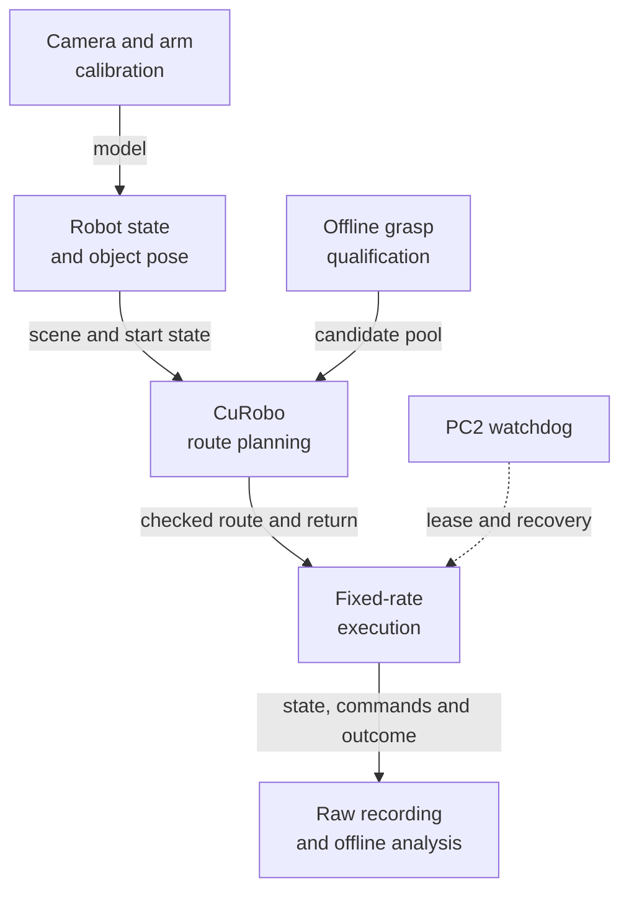

# Working with the G1

This guide explains the G1 research tools: how they connect, where they are
implemented, and what must remain true when you change them. Start with a
subsystem below, follow its diagram into the code, and use the recorded
results and failures to understand its limits.

## Tabletop system at a glance



This is a component map, not a launch sequence. The [system map](start/overview.md)
explains the interfaces; [ownership and safety](control/ownership.md) explains
the control lifecycle. Select **Expand** or scroll horizontally on a narrow screen.

```{admonition} First draft · summer work with follow-up through September 7, 2026
:class: note

This draft awaits the author's review. Procedures and results have different
evidence levels. The latest manually preclosed calibration workflow still
needs new route generation and physical validation; moving-target MPC
remains experimental. Missing installation details and media are collected
in the [review queue](reference/review.md).
```

## Find the part you need

| Your goal | Start with |
|---|---|
| Locate an implementation or give an agent context | [System map](start/overview.md), then the relevant chapter's code map |
| Start working with the lab robot | [Hardware](hardware/robot.md), [setup](start/setup.md), and [control ownership](control/ownership.md) |
| Understand a failed grasp or route | [Grasp atlas](manipulation/grasp-atlas.md), [planning](manipulation/planning.md), and [debugging](reference/debugging.md) |
| Work on calibration | [Workflow](calibration/workflow.md), [results](calibration/results.md), and [investigations](calibration/investigation.md) |
| Inspect Dex3 sensing or the initial simulator | [Pressure tools](sensing/pressure.md), [MuJoCo backend](simulation/mujoco.md) |
| Use the recordings | [Recording and LeRobot](data/recording.md) |
| Continue the documentation | [Maintenance](reference/maintenance.md) and [sources](reference/sources.md) |

## Read a chapter alongside its code

Technical chapters start with a focused Mermaid diagram and a table mapping
its parts to source files and symbols. The explanation then follows the data
or control flow, including assumptions, rejected approaches and validation.
Mermaid source remains in the Markdown, so an agent can read the graph too.

Public code links pin the inspected revision. **Local snapshot** links identify
the exact path, symbol and hash when that implementation is not yet published;
the [code index](reference/code-index.md) explains how to resolve them.
The [About page](about.md) records authorship and project context.

```{toctree}
:hidden:
:caption: Start here
:maxdepth: 1

System map and code entry points <start/overview>
Repositories and setup <start/setup>
```

```{toctree}
:hidden:
:caption: Hardware and control
:maxdepth: 1

The lab robot <hardware/robot>
Camera and network <hardware/camera>
Ownership and safety <control/ownership>
Operating and recovering <control/runbook>
G1Pilot bring-up <control/g1pilot>
```

```{toctree}
:hidden:
:caption: Perception and calibration
:maxdepth: 1

Printed targets and mounts <perception/targets>
Object pose estimation <perception/object-pose>
Calibration model and workflow <calibration/workflow>
Calibration results and limits <calibration/results>
Investigation record <calibration/investigation>
Body motion and state estimation <perception/state-estimation>
```

```{toctree}
:hidden:
:caption: Grasping and planning
:maxdepth: 1

GraspGen-X and the grasp atlas <manipulation/grasp-atlas>
Assembly experiments <manipulation/assembly>
CuRobo planning contracts <manipulation/planning>
Pickup and stacking <manipulation/tasks>
Moving-target MPC <manipulation/mpc>
```

```{toctree}
:hidden:
:caption: Sensing, simulation, and data
:maxdepth: 1

Dex3 pressure <sensing/pressure>
MuJoCo digital twin <simulation/mujoco>
Recording and LeRobot <data/recording>
```

```{toctree}
:hidden:
:caption: Reference and maintenance
:maxdepth: 1

Debugging from evidence <reference/debugging>
Sources and attribution <reference/sources>
Code index <reference/code-index>
Media catalog <reference/media>
Maintaining this guide <reference/maintenance>
Writing diagrams <reference/diagrams>
Draft review queue <reference/review>
About this guide <about>
```
