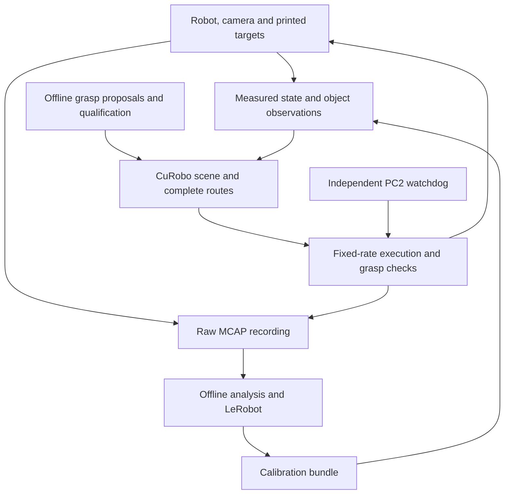

# Working with the G1

During the summer, I used the Unitree G1 to understand what it would take to
make the robot useful for research: what it could do, where its models and
interfaces fell short, and what tooling would let someone else build on the work.
{ .lead }

The work grew from G1Pilot bring-up and an initial MuJoCo backend into printed
fiducial targets, Dex3 sensing, camera and arm calibration, offline grasp
qualification, CuRobo planning, physical cube manipulation, and continuous
recording. Much of the effort went into the transitions between these pieces:
acquiring control without a jump, preserving the command while planning,
recognizing a failed grasp, and returning the robot to a known state.

This guide preserves those details. It explains the working tools and the
experiments that changed them, including approaches that looked reasonable
but failed on the real system. The aim is for the next lab member to start
from that experience and extend it with confidence.

!!! note "First draft · summer work with follow-up through September 7, 2026"
    This draft awaits the author's review. Procedures and results have different
    evidence levels. The latest manually preclosed calibration workflow still
    needs new route generation and physical validation; moving-target MPC
    remains experimental. Missing installation details and media are collected
    in the [review queue](reference/review.md).

## Where to begin

| Your goal | Start with |
|---|---|
| Understand the summer's contributions | [Overview and results](start/overview.md), then [timeline](start/timeline.md) |
| Start working with the lab robot | [Hardware](hardware/robot.md), [setup](start/setup.md), and [control ownership](control/ownership.md) |
| Understand a failed grasp or route | [Grasp atlas](manipulation/grasp-atlas.md), [planning](manipulation/planning.md), and [debugging](reference/debugging.md) |
| Work on calibration | [Workflow](calibration/workflow.md), [results](calibration/results.md), and [investigations](calibration/investigation.md) |
| Use the recordings | [Recording and LeRobot](data/recording.md) |
| Continue the documentation | [Maintenance](reference/maintenance.md) and [sources](reference/sources.md) |

## How the pieces connect

The [G1Pilot digital twin](simulation/mujoco.md) is a separate early development
path. It offers familiar SDK interfaces in MuJoCo; it does not reproduce the
proprietary Unitree walking controller or certify the later tabletop pipeline.

This guide follows the practical style of the earlier
[SPARK documentation](https://rpm-lab-umn.github.io/spark-data-collection/).
The [source catalog](reference/sources.md) explains which supporting records
are public and which still require a lab archive.
