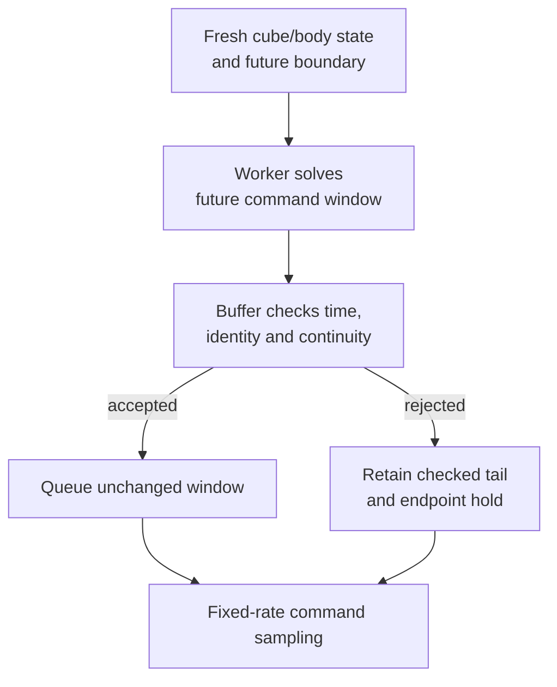

# Moving-target MPC: experimental final approach

Experimental MPC updates only the final pregrasp-to-grasp approach. A solver result is a proposed future window; the command buffer must accept it before the controller uses it.

## Follow the code

| Diagram component | Code entry point | Responsibility |
|---|---|---|
| Moving target update | [tabletop_mpc.py](https://github.com/sri299792458/g1-dex3-tabletop/blob/7400aff201c2f73ef2a64e546d72bd66cbe87fd6/src/g1_dex3_tabletop/planning/tabletop_mpc.py#L1934) · `MovingGraspMPC.update_moving_grasp_goal` | Use the observed object with the selected grasp geometry. |
| Worker solve | [tabletop_mpc.py](https://github.com/sri299792458/g1-dex3-tabletop/blob/7400aff201c2f73ef2a64e546d72bd66cbe87fd6/src/g1_dex3_tabletop/planning/tabletop_mpc.py#L2269) · `MovingGraspMPC.solve_window` | Produce predicted motion and a command window for the frozen handoff. |
| Window acceptance | [mpc_command_buffer.py](https://github.com/sri299792458/g1-dex3-tabletop/blob/7400aff201c2f73ef2a64e546d72bd66cbe87fd6/src/g1_dex3_tabletop/mpc_command_buffer.py#L359) · `RollingMPCCommandBuffer.install` | Reject stale, fast, discontinuous or wrong-predecessor windows. |
| Command sampling | [mpc_command_buffer.py](https://github.com/sri299792458/g1-dex3-tabletop/blob/7400aff201c2f73ef2a64e546d72bd66cbe87fd6/src/g1_dex3_tabletop/mpc_command_buffer.py#L540) · `RollingMPCCommandBuffer.command` | Sample the accepted window and retain its endpoint hold. |

A high-level solve rejection is distinct from a low-level control fault. The diagram assumes state freshness, the control driver and watchdog remain healthy. The independent safety path still governs an actual loss of control health.

## Scope narrowed to the final approach

Early versions tried broader phase tracking. The retained design applies MPC
only from fresh visual pregrasp to grasp. MotionGen still owns global approach,
payload transport, placement and return. A fixed-cube reference at clearance
and fresh cube/IMU observations update the target during the final approach.
A one-time ChArUco observation cannot observe later unmodeled translation.

## An asynchronous solver must not interrupt control

Each accepted window has an absolute activation time, predecessor identity
and predicted/commanded `q`, `dq`, `ddq`. The reviewed contract uses a 240 ms
future handoff and a 0.8 s, 81-state tail that ends at zero velocity and
acceleration. If a replacement is rejected or late, that previously checked tail
decelerates into a hold.

Command-minus-measured tracking offset is remeasured for the full window.
It must not be faded away, accumulated repeatedly or treated as a constant
from an old prediction. Both predicted physical geometry and desired command
geometry are checked. An early ideal-plant replay with measured equal commanded
hid a persistent-offset stall.

One physical window requested 0.257 rad/s against a 0.2 rad/s limit and was
correctly rejected. A rejected high-level solve must leave a healthy low-level
hold in place while bounded retries remain possible. Expiring a planning
deadline must not independently drop torque ownership.

## Progress must be relative to the current object

Nominal joint progress could report advancement while missing a moving goal.
An object-relative criterion improved a simulated 5 mm target-movement case:
81 windows over 20 s reached 3.704 mm and 0.954° terminal error. Reusing the
worker reduced one post-grasp continuation solve to 2.01 s from roughly 14 s.
These are specific replay/planning results, not successful moving-target
hardware commissioning.

## The unresolved physical constraint conflict

On August 21, the measured physical goal had 7.074 mm table clearance, but
the desired command under the tracking-offset model had −1.588 mm. Bringing
that command to the required 5 mm floor needed a 6.588 mm shift, exceeding
the 5 mm target tolerance.

A tested padding workaround produced 194 valid windows without satisfying
termination; error remained about 6.27 mm. The workaround was removed. It did
not solve the incompatibility, and the notes do not authorize another physical
attempt using that padding. A related corrected offset test exposed a real
0.06 mm self-collision and was rejected rather than hidden by a tolerance.

The useful result is a clearer execution and rejection contract, together with
a concrete remaining limitation. Future changes should reproduce the measured
tracking-offset case and show how both endpoint and clearance requirements
are met before claiming an improved moving-target controller.

Evidence: tabletop MPC development, nonideal replay and August 21 endpoint
analysis. [Source identities](../reference/sources.md).

## Checks and evidence to inspect

[test_mpc_command_buffer.py](https://github.com/sri299792458/g1-dex3-tabletop/blob/7400aff201c2f73ef2a64e546d72bd66cbe87fd6/tests/test_mpc_command_buffer.py) checks future boundaries, tracking-offset preservation, rejection and held endpoints. [test_tabletop_workflow.py](https://github.com/sri299792458/g1-dex3-tabletop/blob/7400aff201c2f73ef2a64e546d72bd66cbe87fd6/tests/test_tabletop_workflow.py) contains the rejected-window retry cases. The physical endpoint/clearance conflict above remains unresolved; this path is not a commissioned moving-object capability.
