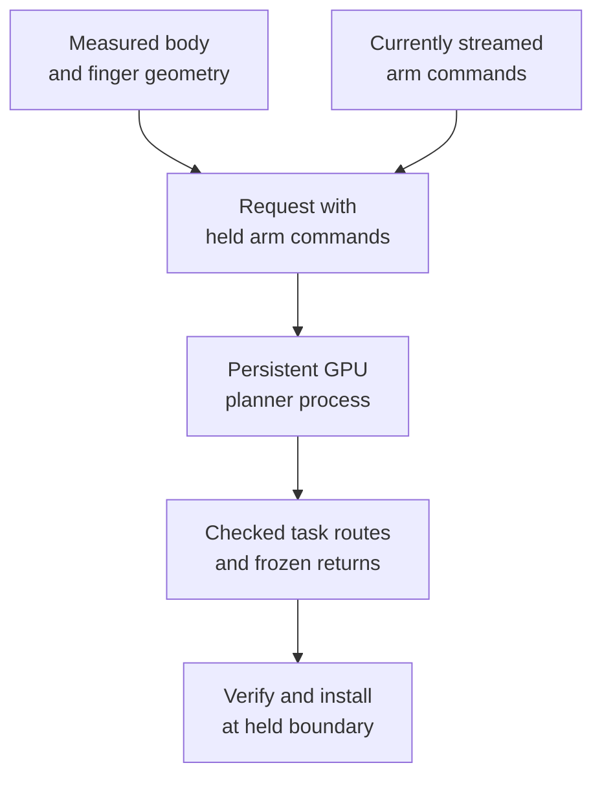

# CuRobo planning contracts

The planner must return a route the currently controlled robot can enter,
execute and leave safely. Finding an IK solution or a collision-free forward
motion is only part of that job: the start must match the command being sent,
and the task needs checked return paths.

Read this chapter when replacing a planner, adding a task phase or debugging
a rejected route. [Cube stacking](tasks.md) shows these contracts exercised in one physical task.

## Measured state and commanded state are different inputs

Measured state defines geometry and contact. The exact active command defines
the join to an already streaming trajectory. Approximately 0.02 rad of physical
tracking error is not permission to insert that difference as a command jump.
Frozen joins were checked to 1e-9 where exact command continuity was required;
float32 anchoring only addresses scale-dependent numerical roundoff.

For example, suppose an arm joint is commanded to 0.50 rad but measures
0.48 rad. Starting a new command trajectory at 0.48 rad would insert a 0.02 rad
command step. The next route must join the 0.50 rad command already being sent;
measured body and finger state still matter when evaluating geometry. These
numbers illustrate the distinction, rather than describing another robot run.

The diagram shows how those two inputs meet at the planner boundary. The GPU
worker returns a proposal; the controller checks it before installation.

## Model the measured robot

The tabletop model contains 49 coordinates: seven active arm joints and
42 locked coordinates. Both hands and their marker geometry are represented.
Locked means fixed for a planning problem, not absent from collision geometry.
Refold current measured locked state when reusing a worker.

Map joints by names across DDS, URDF and CuRobo. The hands' index/middle order
is not consistent with an arbitrary seven-element slice. Model topology,
object/fixture profile and attachment configuration determine whether a
cached planner is reusable.

The CPU/ROS controller and GPU planner are separate processes. Planner results
carry the model/scene identity and the start they were solved from. A solver
should not construct a robot publisher or change ownership.

## Preserve alternatives without exhausting GPU memory

Submitting all 1,544 IK candidates at once exhausted memory. Batches of 128
reduced the observed memory requirement to about 4.2 GB. Each candidate received
independent seeds so early goal-set choices did not starve later branches.
The fallback tested the finite pool before declaring the problem unreachable.

CuRobo mutates an input `JointState` in the examined code path. Reusing that
object between attempts quietly changed later starts. Build a fresh per-attempt
state; reuse the expensive planner separately.

## Strict collision checks remain independent

A selected-arm 400 × 400 × 20 mm table patch helped optimization. The observed
cube did not register the entire 1,400 × 700 mm table, so the patch cannot claim
that physical coverage. Independent support-plane validation checks the moving
wrist, hand and payload. It does not certify unseen table edges or every elbow
configuration.

Early selected-shoulder negative buffers and monotonic escape from overlapping
starts were removed. **The current live start must be strictly clear.** Pruning
invariant locked/locked pairs does not remove active-arm collision checks.
Roundoff corrections are limited to numerical error and cannot repair a real
state discontinuity.

The cube payload uses 27 circumscribed cells to preserve conservative coverage.
An alternative attachment path silently retained only two of 16 proposed
spheres, illustrating why the attached model must be inspected after creation.

## Interpreting contact before using a payload route

The initial simulated achieved joint vector was replaced by the descriptor's
fixed close command. Grasp checks then evolved through single-joint stall and
opposed-pressure gates to commissioned **measured empty-close** references.

The current criterion requires a closing-direction shortfall of at least
0.05 rad on the thumb and an opposing closing joint, relative to that hand's
empty close. The hand must settle over 0.5 s within 0.01 rad spread, and the
criterion includes evidence that closing was commanded. The same opposed
contact check runs after a 30 mm retention checkpoint during the 100 mm lift.

This is a joint-based contact heuristic for the commissioned grasp family.
Pressure, effort and velocity remain recorded diagnostics; they are not
calibrated force estimates or the primary required cube-contact signal.
Left/right empty-close references are commissioned separately.

Empty **open** is another reference. The task measures the run-local posture
achieved by the descriptor's zero/open target. It does not assume the arbitrary
initial hand posture is open, or require achieved physical joints to equal
zero exactly. Finger changes use the bounded ramp, including the documented
two-second closing/opening transition.

A physical table strike led to a 5 mm motion clearance floor. Contact changes
the fingers, so the payload path is checked again with achieved contact
geometry. A contact start may be positively below 5 mm only under the explicit
policy of not moving deeper, reaching the free-space floor and retaining its
exact reverse. A penetrating start is not admitted.

## Complete routes include recovery

Plan pregrasp, approach, lift, placement and all return transitions. If a
boundary replan fails, an already frozen reverse must remain executable. The
August 17 lift/replacement exposed an omitted `return_to_pregrasp` leg; the
object action happened, but the lifecycle failed afterward.

Keep compatible planner workers warm and avoid rebuilding GPU collision state
for every request. Recorded optimizations reduced planning time while preserving
the strict acceptance checks. Worker reuse must still bind the current scene,
model and request; cached state is not permission to accept a stale plan.

See [ownership](../control/ownership.md) for fixed-rate execution and
[MPC](mpc.md) for the experimental future-window contract.

Evidence: tabletop planning, strict-collision and worker-pool entries.
[Source identities](../reference/sources.md).

## Follow the code

| Implementation concern | Code entry point | Responsibility |
|---|---|---|
| Snapshot boundary | [control_boundary.py](https://github.com/sri299792458/g1-dex3-tabletop/blob/59c21b1388c636176dea67ea7ed3e253f8510783/src/g1_dex3_tabletop/control_boundary.py) · `command_bound_snapshot` (September branch) | Keep measured body/fingers while binding both arm starts to held commands. |
| Process boundary | [persistent_planner.py](https://github.com/sri299792458/g1-dex3-tabletop/blob/7400aff201c2f73ef2a64e546d72bd66cbe87fd6/src/g1_dex3_tabletop/persistent_planner.py#L141) · `PersistentTabletopPlanner.request_payload` | Submit a request while continuing control health checks. |
| Planning session | [tabletop_session.py](https://github.com/sri299792458/g1-dex3-tabletop/blob/7400aff201c2f73ef2a64e546d72bd66cbe87fd6/src/g1_dex3_tabletop/planning/tabletop_session.py#L425) · `TabletopPlanningSession.replan_at_pregrasp` | Bind a same-grasp remainder to the stored clearance request and exact start. |
| Route planning | [tabletop_planner.py](https://github.com/sri299792458/g1-dex3-tabletop/blob/7400aff201c2f73ef2a64e546d72bd66cbe87fd6/src/g1_dex3_tabletop/planning/tabletop_planner.py#L5541) · `plan_tabletop_task` | Solve the task using explicit model, scene and candidate contracts. |
| Opposed contact | [unitree_dex3.py](https://github.com/sri299792458/g1-dex3-tabletop/blob/7400aff201c2f73ef2a64e546d72bd66cbe87fd6/src/g1_aprilcube_calibration/transports/unitree_dex3.py#L355) · `classify_dex3_opposed_joint_obstruction` | Compare measured joints with the commissioned empty-close reference. |
| Retention checkpoint | [unitree_dex3.py](https://github.com/sri299792458/g1-dex3-tabletop/blob/7400aff201c2f73ef2a64e546d72bd66cbe87fd6/src/g1_aprilcube_calibration/transports/unitree_dex3.py#L1049) · `UnitreeDex3PostureController.verify_retention_at_lifted_checkpoint` | Verify retained opposed contact after the short lift. |
| Contact revalidation | [tabletop_planner.py](https://github.com/sri299792458/g1-dex3-tabletop/blob/7400aff201c2f73ef2a64e546d72bd66cbe87fd6/src/g1_dex3_tabletop/planning/tabletop_planner.py#L4048) · `RetentionRouteValidator.validate` | Check the frozen payload route against achieved finger geometry. |
| Plan installation | [control_boundary.py](https://github.com/sri299792458/g1-dex3-tabletop/blob/59c21b1388c636176dea67ea7ed3e253f8510783/src/g1_dex3_tabletop/control_boundary.py) · `install_plan_at_current_boundary` (September branch) | Reject a real command jump before installing or switching arms. |

The shared `control_boundary.py` module is a September extraction. In demo
`main`, the corresponding stack helpers are
[`_command_bound_snapshot` and `_install_plan_at_current_boundary`](../reference/code-index.md#code-demo-stack).
The command-continuity invariant already existed in the demonstrated version.

The snapshot field `measured_q29_rad` deserves care: `command_bound_snapshot` replaces the arm entries with active commands while retaining measured body/finger geometry. Its name alone is not enough to infer every entry is a sensor measurement. Read the constructor and boundary helper together.

## Checks and evidence to inspect

[test_stack_workflow.py](https://github.com/sri299792458/g1-dex3-tabletop/blob/59c21b1388c636176dea67ea7ed3e253f8510783/tests/test_stack_workflow.py) (September branch) preserves the measured-elbow versus held-command regression. [test_tabletop_workflow.py](https://github.com/sri299792458/g1-dex3-tabletop/blob/7400aff201c2f73ef2a64e546d72bd66cbe87fd6/tests/test_tabletop_workflow.py) covers real discontinuity rejection, float32 anchoring, strict collision checks, attached geometry and complete returns. The timings above are reported task-specific measurements, not benchmarks rerun for this guide.
