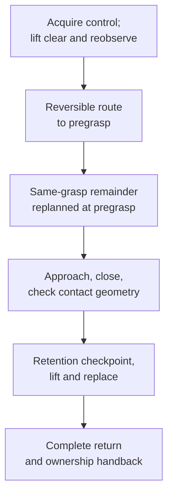

# Physical pickup and stacking

The single-cube and direct-stack coordinators share control and grasp checks but plan at different boundaries. The single-cube trajectory path below makes its pregrasp replan explicit.



## Follow the code

| Diagram component | Code entry point | Responsibility |
|---|---|---|
| Single-cube coordinator | [hardware_tabletop.py](../reference/code-index.md#code-tabletop) · `run_tabletop` (local snapshot) | Connect observation, ownership, planning, fingers, return and recording. |
| Pregrasp route | [tabletop_session.py](https://github.com/sri299792458/g1-dex3-tabletop/blob/cf1b27704c82d877d23ff5a3c157df3218f02402/src/g1_dex3_tabletop/planning/tabletop_session.py#L317) · `TabletopPlanningSession.plan_pregrasp_at_clearance` | Keep a reversible pregrasp route before committing to the remainder. |
| Pregrasp correction | [tabletop_session.py](https://github.com/sri299792458/g1-dex3-tabletop/blob/cf1b27704c82d877d23ff5a3c157df3218f02402/src/g1_dex3_tabletop/planning/tabletop_session.py#L425) · `TabletopPlanningSession.replan_at_pregrasp` | Keep the candidate and command start while updating estimated camera state. |
| Opposed contact | [unitree_dex3.py](https://github.com/sri299792458/g1-dex3-tabletop/blob/cf1b27704c82d877d23ff5a3c157df3218f02402/src/g1_aprilcube_calibration/transports/unitree_dex3.py#L355) · `classify_dex3_opposed_joint_obstruction` | Compare measured joints with the commissioned empty-close reference. |
| Retention checkpoint | [unitree_dex3.py](https://github.com/sri299792458/g1-dex3-tabletop/blob/cf1b27704c82d877d23ff5a3c157df3218f02402/src/g1_aprilcube_calibration/transports/unitree_dex3.py#L1049) · `UnitreeDex3PostureController.verify_retention_at_lifted_checkpoint` | Verify retained opposed contact after the short lift. |
| Direct-stack coordinator | [hardware_stack.py](../reference/code-index.md#code-stack) · `run_stack` (local snapshot) | Choose cube direction/arm and plan the complete transfer at clearance. |

Read the single-cube and stack entry points independently. Direct stacking calls `_find_direct_stack_plan` and `_execute_pick_place`; it does not inherit the extra single-cube pregrasp replan. Both need checked recovery routes and explicit ownership handback.

## Current object and fixture profiles

Use the 40 mm or 60 mm rounded AprilCube profiles described in
[printed targets](../perception/targets.md). The direct two-cube task uses
separate 60 mm ID ranges, 10–15 and 20–25. Each profile binds the detection
geometry, mesh and qualified grasp pool.

The tripod was an intermediate experiment and has been removed from the
tabletop workflow. A completed tripod lifecycle did not prove that the replaced
cube balanced on its three contacts. The later prime-tower fixture is
35.42 × 34.75 × 60 mm, with centered, yaw-aligned top placement. Its qualified
pools contained 113 grasps for 40 mm cubes and 312 for 60 mm cubes.

The commissioned arm default became 0.2 rad/s after August 20 physical trials;
0.1 rad/s belongs to earlier commissioning. Default pregrasp separation is
50 mm for both cube sizes. These values apply to the recorded profiles and
routes, not arbitrary hand/object configurations.

## A close command needs a contact interpretation

The initial simulated achieved joint vector was replaced by the descriptor's
fixed close command. Grasp checks then evolved through single-joint stall and
opposed-pressure gates to commissioned **measured empty-close** references.

The current criterion requires a closing-direction shortfall of at least
0.05 rad on the thumb and an opposing closing joint, relative to that hand's
empty close. The hand must settle over 0.5 s within 0.01 rad spread, and the
criterion includes evidence that closing was commanded. The same opposed
contact check runs after a 30 mm retention checkpoint during the 100 mm lift.

This is a joint-based contact heuristic for the commissioned grasp family.
Pressure, effort and velocity remain recorded diagnostics; they are not
calibrated force estimates or the primary required cube-contact signal.
Left/right empty-close references are commissioned separately.

Empty **open** is another reference. The task measures the run-local posture
achieved by the descriptor's zero/open target. It does not assume the arbitrary
initial hand posture is open, or require achieved physical joints to equal
zero exactly. Finger changes use the bounded ramp, including the documented
two-second closing/opening transition.

## Single-cube trajectory workflow

1. Observe the supported scene and acquire from measured state.
2. Lift to clearance, allow the body to settle and reobserve the fixed cube.
3. Plan and execute a reversible pregrasp route using the qualified pool and
   strict collision checks.
4. At pregrasp, propagate the camera anchor and plan the complete same-grasp
   remainder; retain the earlier exact reverse if this replan fails.
5. Approach, close and check opposed contact; validate the actual contact fingers.
6. Lift through the retention checkpoint, place, open and execute the complete return.
7. Verify the ownership handoff before shutting down recording/resources.

This is a lifecycle map, not an independent executable launch procedure.
Use the source revision's entry point and [runbook](../control/runbook.md).

## Direct two-cube transfer

The coordinator evolved from two-stage 60+40 and two-60 tasks to one direct
pick/place transfer. It searches both directed cube assignments and both arms,
with one task arm moving at a time. A candidate must serve the source grasp,
destination placement and connecting transfer.

Intersecting endpoint-feasible pools rejected a 0/57 case in roughly 12 s
instead of a previously observed eight-minute nested route search. Four upright
yaw symmetries are evaluated together in the order 0, 1, 3, 2 quarter turns.
Existing source-plus-destination joint-distance scores help avoid unnecessary
wrist twist; that is candidate ordering, not a new physical clearance margin.

The stack route is planned completely at clearance. It does not include the
extra single-cube pregrasp replan. After placing a lower object in workflows
that need a second stage, its actual pose must be observed again.

One bounded physical grasp retry is allowed only after completing the frozen
recovery, acquiring a fresh scene and excluding the failed candidate. A control
fault is not a reason to retry automatically.

## Interpreting the demonstrations

The August 17 `T230114` run lifted and replaced the cube but later failed on an
omitted return leg. The August 18 `T162801` tripod run completed its lifecycle
without establishing precise post-release balance. August 21 retained
13 completed stack requests with the August calibration baseline; their count
comes from recording boundaries, not an independent success-rate annotation.

Retained sessions keep control/resources between episodes. SPACE starts a new
episode; Ctrl+C between episodes requests clean handback, while interruption
inside an episode follows its fault/recovery handling. See [recording](../data/recording.md)
for preserving those boundaries.

## Source launcher examples

These examples transcribe the inspected tabletop launcher. Run them only from
the matching `g1-dex3-tabletop` checkout, after the [setup](../start/setup.md)
and [operator preflight](../control/runbook.md), with seated FSM 3, supported
stationary arms, the camera running and the required objects visible. Set
`G1_NETWORK_INTERFACE` to the Ethernet interface connected to the robot.
The acknowledgement and SPACE preview remain part of the source workflow.

For the right-arm 40 mm cube task using the recorded August baseline:

```bash
./tools/g1_tabletop_hardware.sh run-tabletop \
  --arm right \
  --network-interface "${G1_NETWORK_INTERFACE:?Set the robot Ethernet interface}" \
  --object-profile cube40-r3 \
  --calibration-bundle config/calibrations/dex3_shared_20260812_selected_free.json \
  --confirm 'I CONFIRM THE G1 IS SECURED BY THE LOAD-BEARING HARNESS AND THE WORKSPACE IS CLEAR'
```

For the two visible 60 mm cubes with distinct ID ranges:

```bash
./tools/g1_tabletop_hardware.sh run-stack \
  --network-interface "${G1_NETWORK_INTERFACE:?Set the robot Ethernet interface}" \
  --calibration-bundle config/calibrations/dex3_shared_20260812_selected_free.json \
  --confirm 'I CONFIRM THE G1 IS SECURED BY THE LOAD-BEARING HARNESS AND THE WORKSPACE IS CLEAR'
```

The explicit bundle path selects the historical baseline; it does not make
that bundle valid after a camera or target change. These launch examples were
checked against source text and were not executed during documentation.

Evidence: tabletop physical runs and later Friday-baseline/direct-stack rebuild.
[Source identities](../reference/sources.md).

## Checks and evidence to inspect

[test_tabletop_workflow.py](https://github.com/sri299792458/g1-dex3-tabletop/blob/cf1b27704c82d877d23ff5a3c157df3218f02402/tests/test_tabletop_workflow.py) and [test_stack_workflow.py](../reference/code-index.md#code-test-stack) (local snapshot) encode boundary, return and retry regressions. Inspect recorded close/retention evidence and cleanup outcome separately from task completion. The August runs below are the physical record; source tests alone cannot establish grasp success.
