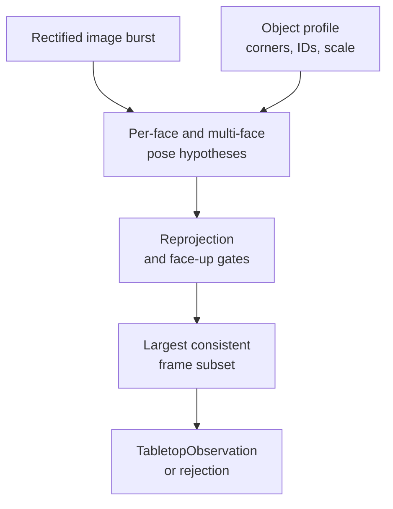

# Estimating object pose

A resting-cube observation combines several fresh images into one accepted pose, with the camera profile and source-frame hashes retained.

## Follow the code

| Diagram component | Code entry point | Responsibility |
|---|---|---|
| Object geometry | [tabletop_object.py](https://github.com/sri299792458/g1-dex3-tabletop/blob/cf1b27704c82d877d23ff5a3c157df3218f02402/src/g1_dex3_tabletop/tabletop_object.py) | Select dimensions, target IDs and runtime object profile together. |
| Hypotheses and geometric gates | [tabletop_perception.py](https://github.com/sri299792458/g1-dex3-tabletop/blob/cf1b27704c82d877d23ff5a3c157df3218f02402/src/g1_dex3_tabletop/tabletop_perception.py#L240) · `_detect_resting_pose_hypotheses` | Retain valid pose branches rather than trusting one planar solve. |
| Frame consensus | [tabletop_perception.py](https://github.com/sri299792458/g1-dex3-tabletop/blob/cf1b27704c82d877d23ff5a3c157df3218f02402/src/g1_dex3_tabletop/tabletop_perception.py#L129) · `_largest_hypothesis_consensus` | Choose one coherent hypothesis per accepted frame. |
| Observation artifact | [tabletop_perception.py](https://github.com/sri299792458/g1-dex3-tabletop/blob/cf1b27704c82d877d23ff5a3c157df3218f02402/src/g1_dex3_tabletop/tabletop_perception.py#L345) · `observe_resting_cube` | Bind pose/spread, snapshot, camera-profile hash and image hashes. |
| Two-cube observation | [tabletop_perception.py](https://github.com/sri299792458/g1-dex3-tabletop/blob/cf1b27704c82d877d23ff5a3c157df3218f02402/src/g1_dex3_tabletop/tabletop_perception.py#L412) · `observe_resting_cube_pair` | Require sufficient common frames, then recompute both observations. |

Follow `observe_resting_cube` first, then its two private helpers. Failure to meet a gate raises a rejection; it does not produce a lower-confidence pose for the planner. `observe_live_cube_frame` is a separate single-frame path for experimental reactive control, where a burst average would lag the moving object.

## Keep pixels and geometry consistent

Use the selected object profile to bind mesh, marker dimensions, dictionary,
corner coordinates and grasp shortlist. Convert millimetres to metres once at
the interface. Rectified images use the corresponding projection matrix `P`;
raw intrinsics `K` are not interchangeable with it.

For calibration, only decoded corners from the current image enter the fit.
Tracked or recovered quadrilaterals, optical flow and filtered poses may be
useful for visualization, but would change the measurement model if inserted
without an explicit decision.

## Why the detector changed

Early tabletop work selected the largest well-resolved face, considered both
planar IPPE pose branches, rejected negative depth and refined the selected
solution with Levenberg–Marquardt. On 326 retained frames, raw grayscale worked
better than CLAHE. Contrast enhancement was therefore not a default cure for
poor corners. A roughly 13 px corner error must be diagnosed as an image-space
failure before interpreting the inferred pose as physical motion.

Later resting-cube observations showed that largest-face selection alone
could produce a systematic tilt of about 30°. The updated procedure considers
all positive-depth per-face IPPE hypotheses together with nonplanar multi-face
solutions. It applies a 3 px reprojection gate and a 20° face-up gate, then
requires the largest consistent subset of at least three of five observations
within 5 mm and 2°.

Those values describe this implementation's acceptance policy. They are not a
measurement of absolute 5 mm accuracy. A wrong target size or camera extrinsic
can produce consistent but biased observations.

## A cube observes a plane, not the table boundary

A resting cube supplies a local support plane through its geometry. It does
not determine the corners of the physical table. The planner's finite table
patch is an optimization convenience; independent plane checks still cover
the relevant wrist, hand and payload. Unseen edges and an elbow outside that
coverage require separate consideration in the physical setup.

The object is canonicalized using its cube symmetry, so an old requirement
for one particular tag to face upward is obsolete. Symmetry changes the
description of an equivalent object pose; it does not excuse a mismatch between
the detection model and the printed object.

## Reobserve after the body settles

Lifting the arms from a supported seated pose changed the camera relative to
the table. A pose observed before that movement was not a reliable reference
for final contact. The single-cube trajectory workflow therefore lifts to
clearance, reobserves the stationary cube, and anchors the body-motion estimate
there. At pregrasp, it propagates the camera estimate and replans the remaining
approach for the same grasp while retaining a complete reverse route.

Store the synchronized anchor before lengthy planning: waiting until afterward
once lost the matching sample from a 4,096-entry state buffer. This was a
history-retention bug, not evidence that the IMU had stopped publishing.

See [state estimation](state-estimation.md), [planning](../manipulation/planning.md)
and [pickup/stacking](../manipulation/tasks.md) for the separate execution paths.

Evidence: tabletop August 17–24 perception and reobservation entries, with
later corrections taking precedence. [Source identities](../reference/sources.md).

## Checks and evidence to inspect

[test_tabletop_workflow.py](https://github.com/sri299792458/g1-dex3-tabletop/blob/cf1b27704c82d877d23ff5a3c157df3218f02402/tests/test_tabletop_workflow.py) contains the pose-hypothesis, largest-three-frame-consensus and rejection cases. The 326-frame grayscale comparison and later resting-cube tilt failure explain the policy changes below. Consensus thresholds establish acceptance, not absolute accuracy.
