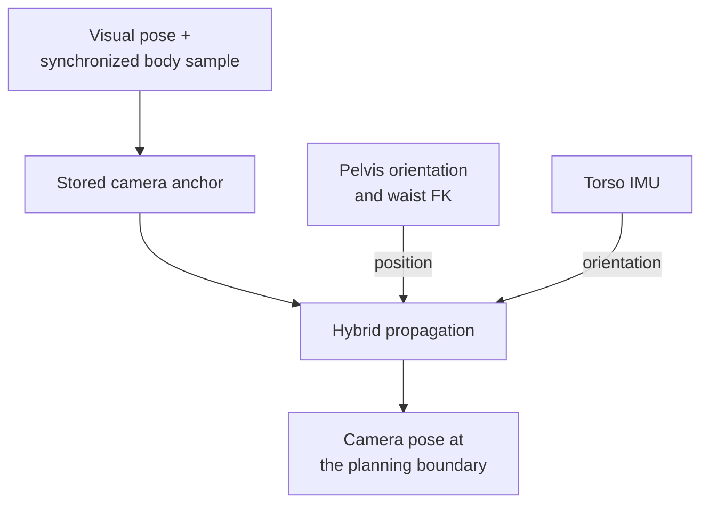

# Body motion and camera state

Lifting the arms from the table changes the load on a seated G1. The head
camera can move relative to a stationary cube even though the head joint was
not adjusted. A cube pose taken before the lift can therefore be stale by the
time the fingers approach it.

The single-cube workflow first observes again at clearance, then estimates
camera motion up to pregrasp. This chapter explains that local correction,
its measured benefit and the motion it cannot observe.

## A local hybrid observer

The observer divides the estimate into position and orientation. The arrows
show the measured inputs for each; neither branch observes global translation.

The observer combines a visual anchor, pelvis orientation, all three measured
waist joints and torso IMU orientation. Pelvis/waist FK supplies position;
the torso IMU supplies the camera body's orientation. Its position construction
assumes a locally fixed pelvis IMU origin under the chosen support/contact.
This is not global odometry and does not observe arbitrary planar translation.

On the rigid settled endpoints, reported apparent error changed as follows:

| Arm | Before correction | Hybrid correction |
|---|---|---|
| Left | 5.355 mm / 0.707° | 1.052 mm / 0.123° |
| Right | 5.260 mm / 0.790° | 1.220 mm / 0.104° |

Continuous replay was harder. A single visual anchor gave 4.661 mm mean error;
resets every 1.335 s gave 0.371 mm mean and 0.873 mm p95, while 2.002 s gave
0.427 mm mean and 0.993 mm p95. These are offline replay results under that
observation model, not a real-time absolute-accuracy specification.

## What the chair comparison showed

The August 16 study completed five lift pairs per arm on cushion and rigid
support. Settled apparent motion was approximately 10.4–10.8 mm and 1.4–1.7°
on the cushion, versus roughly 5.3 mm and 0.7–0.8° on rigid support.

The runs were not posture-matched: waist pitch differed by about 7.118° versus
0.101°, and the board normal differed by about 15°. Rigid support became the
practical baseline, but the data do not isolate cushion compliance as the sole
cause. The first loaded burst also included planning-time drift; subsequent
analysis compared cycles 2–5 with their neighboring returned states. Later
capture added a pre-lift baseline.

## Synchronization is part of the estimator

MCAP receipt time, image header time and device ticks are different clocks.
Each producer needs its own mapping to the recording clock. RGB and depth
had a roughly 66.67 ms phase relationship in the examined data; assuming
identical timestamps would pair different observations.

The native depth plane was useful for relative height/tilt and could retain a
stable bias. It did not provide absolute in-plane motion. Double-integrating
D435i acceleration did not solve the missing translation problem. Production
camera propagation therefore did not silently add depth as an estimator input.

## Where this entered manipulation

The single-cube trajectory workflow reobserves the fixed cube after a 100 mm
clearance lift, stores the synchronized anchor, then propagates camera motion
to pregrasp. It replans the remaining same-grasp approach and preserves the
previous exact reverse if that replan fails.

The direct stacking coordinator plans its complete clearance route and does
not include that extra single-cube pregrasp replan. The experimental
[moving-target MPC](../manipulation/mpc.md) adds fresh visual observations during
the final approach and has a different validation status.

Evidence: tabletop August 16 support/observer study, later replay and trajectory
integration entries. [Source identities](../reference/sources.md).

## Follow the code

| Implementation concern | Code entry point | Responsibility |
|---|---|---|
| Synchronized body sample | [camera_state_sync.py](https://github.com/sri299792458/g1-dex3-tabletop/blob/7400aff201c2f73ef2a64e546d72bd66cbe87fd6/src/g1_dex3_tabletop/camera_state_sync.py#L144) · `CameraStateInputBuffer.sample_at` | Select measured body inputs at the requested timestamp. |
| Visual anchor | [state_estimation.py](https://github.com/sri299792458/g1-dex3-tabletop/blob/7400aff201c2f73ef2a64e546d72bd66cbe87fd6/src/g1_dex3_tabletop/state_estimation.py#L312) · `AnchoredCameraStateEstimator.reset` | Store the reference transform and matching sample together. |
| Hybrid propagation | [state_estimation.py](https://github.com/sri299792458/g1-dex3-tabletop/blob/7400aff201c2f73ef2a64e546d72bd66cbe87fd6/src/g1_dex3_tabletop/state_estimation.py#L215) · `AnchoredCameraPoseEstimators.predict` | Combine the declared position and orientation hypotheses. |
| Estimate consumed by planning | [state_estimation.py](https://github.com/sri299792458/g1-dex3-tabletop/blob/7400aff201c2f73ef2a64e546d72bd66cbe87fd6/src/g1_dex3_tabletop/state_estimation.py#L327) · `AnchoredCameraStateEstimator.estimate` | Require an anchor and reject a sample older than it. |
| Single-cube boundary request | [tabletop_workflow.py](https://github.com/sri299792458/g1-dex3-tabletop/blob/7400aff201c2f73ef2a64e546d72bd66cbe87fd6/src/g1_dex3_tabletop/tabletop_workflow.py#L197) · `request_at_estimated_pregrasp` | Carry the estimated camera state into a same-grasp replan. |

The output is a camera transform in the anchor reference frame, not a globally observed pelvis position. Store the synchronized anchor before waiting for the GPU planner; otherwise its matching state sample can age out of the buffer.

## Checks and evidence to inspect

[test_state_estimation.py](https://github.com/sri299792458/g1-dex3-tabletop/blob/7400aff201c2f73ef2a64e546d72bd66cbe87fd6/tests/test_state_estimation.py) checks anchor reproduction and the hybrid position/orientation split; [test_camera_state_sync.py](https://github.com/sri299792458/g1-dex3-tabletop/blob/7400aff201c2f73ef2a64e546d72bd66cbe87fd6/tests/test_camera_state_sync.py) covers sample pairing. The chair and continuous-replay results above provide the recorded experimental limits. They do not establish unrestricted live odometry.
