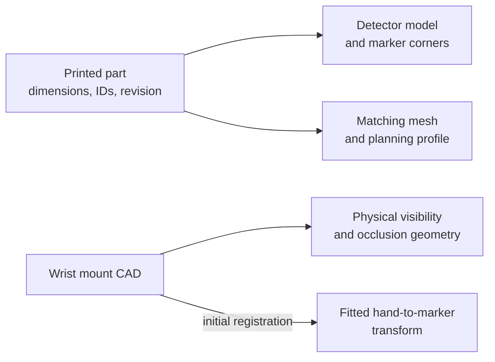

# Printed targets and mounts

Target geometry must stay consistent across the printed part, detector and planner. Wrist-marker CAD and fitted target registration are related but serve different purposes.



## Follow the code

| Diagram component | Code entry point | Responsibility |
|---|---|---|
| Runtime cube profile | [tabletop_object.py](https://github.com/sri299792458/g1-dex3-tabletop/blob/cf1b27704c82d877d23ff5a3c157df3218f02402/src/g1_dex3_tabletop/tabletop_object.py) | Bind cube dimensions, marker profile and task geometry. |
| Dorsal mount specification | [dex3_dorsal_mount.py](https://github.com/sri299792458/g1-dex3-tabletop/blob/cf1b27704c82d877d23ff5a3c157df3218f02402/src/g1_aprilcube_calibration/dex3_dorsal_mount.py#L28) · `Dex3DorsalMountSpec` | Record dimensions and handed mounting geometry. |
| Physical marker transform | [dex3_dorsal_mount.py](https://github.com/sri299792458/g1-dex3-tabletop/blob/cf1b27704c82d877d23ff5a3c157df3218f02402/src/g1_aprilcube_calibration/dex3_dorsal_mount.py#L221) · `palm_T_marker_face` | Compute the handed CAD marker pose. |
| Mount artifact | [dex3_dorsal_mount.py](https://github.com/sri299792458/g1-dex3-tabletop/blob/cf1b27704c82d877d23ff5a3c157df3218f02402/src/g1_aprilcube_calibration/dex3_dorsal_mount.py#L297) · `mount_manifest` | Export geometry and metadata for the mount. |

The cube and wrist-marker branches are separate targets. Read the dimensions below before selecting a mesh or detector dictionary. For wrist visibility use the physical transform; for a selected calibration’s residuals use that fit’s registered transform.

## AprilCubes

```{figure} ../assets/images/printed-target-collection.jpg
:alt: Large and small printed marker cubes, a separate wrist-marker plate with a mounting tab, and a ChArUco board laid out on a table.

The physical target collection, photographed September 21: large and small
marker cubes, a wrist-marker carrier and a ChArUco board. The profiles below
define dimensions and dictionaries; the photograph alone does not establish
a fitted wrist mount or a qualified torso reference.
```

The July AprilCube fork added rounded cuboids and printable assemblies while
keeping the flat marker coordinate planes unchanged. An early approach rounded
each voxel separately. That left seams in T-shaped unions, so the implementation
moved to morphological opening of the solid union using Manifold. Printable,
render and collision geometry could then share the same construction.

| Runtime object | Edge / perimeter radius | Marker edge and dictionary | IDs |
|---|---|---|---|
| Small cube | 40 mm / 3 mm | 30 mm, `4x4_100` | 0–5 |
| Primary large cube | 60 mm / 3 mm | 45 mm, `4x4_100` | 10–15 |
| Secondary large cube | 60 mm / 3 mm | 45 mm, `4x4_100` | 20–25 |

The final 40 mm design replaced a 50 mm, 8 mm-radius design. Separately, the
grasp-generation study used 45 mm geometry before the physical runtime was
corrected to 40 mm. These are different experiments. New 40 mm proposals were
generated and qualified; scaling the 45 mm atlas would change contact geometry.

The fork notes report 48/48 successful synthetic views and 14 focused tests.
An unrelated `AuxCamera` import failure was excluded from those checks. This
establishes the reported geometry/detection checks, not print quality for every
physical target. A pit in a white marker cell was suspected to involve a nozzle
change; the notes proposed repair and rechecking without confirming that cause
or a completed repair.

For a replacement target, preserve the mesh, marker corner coordinates,
dictionary, IDs, scale and print revision together. Inspect the printed edges
and cell contrast before using its detections in a fit.

## Dex3 dorsal markers

The wrist calibration targets attach to the rigid hand shells. They make the
hand visible from the head camera without requiring a target held by the fingers.

The revision-2 carrier has a 50 × 50 mm optical plate and a 30 × 10 mm tab,
giving a 50 × 60 mm outline and 4 mm plate thickness. It carries a 40 mm
`6x6_50` marker: right ID 4, left ID 5. The quiet border is 5 mm and the
inlay depth is 0.6 mm.

The two M3 holes are 15 mm apart and have a documented 3 mm blind depth.
The specified M3×8 ISO 10642 stack leaves approximately 2.5 mm engagement
and 0.5 mm reserve after a 5.5 mm stack. A longer M3×10 screw is not an
equivalent substitution. Confirm the source drawing and the actual shell
before reproducing the fit.

The first physical print exposed an important CAD assumption: its nominal
2 mm third support did not contact the shell. Accounting for the local tangent
changed revision 2 to a 2.57 mm support and approximately 1.994° angle. A
three-point support is only rigid when all three points actually seat.

Right dorsal is on negative palm Y; left dorsal is on positive palm Y. Copying
the right-hand target transform to the left produced an invisible target in
planning. Use the handed CAD transforms and a proper rotation.

```{admonition} Physical geometry and fitted geometry serve different purposes
:class: note

A free calibration target transform can absorb FK error and place an
effective marker inside the palm. Use the physical CAD target for visibility
and occlusion tests. Use the selected fitted transform when evaluating its
calibration model. Neither should silently replace the other.
```

## Torso ChArUco carrier

Several carrier designs explored a repeatable torso reference. The final
documented v4 design uses one multicolor H2D carrier with four arms attached
at external M6 holes. The active board is 6 × 9 squares, with 30 mm squares,
22 mm markers and `5x5_50`, covering 180 × 270 mm. Earlier paper/`4x4` designs
and obstructed screw-access arrangements are superseded.

The notes do **not** establish a physically qualified torso extrinsic standard.
Root fit, board flatness, screw engagement and reinstall repeatability remain
to be checked. A rear waist fastener is not automatically an accessory datum.

Evidence: AprilCube July 13–15 log; prototype dorsal-marker and torso-carrier
documents; tabletop object-profile corrections. See [sources](../reference/sources.md)
and the [media requests](../reference/review.md).

## Checks and evidence to inspect

The fork’s synthetic views establish geometry/detection checks, while the first dorsal print supplies the physical third-support correction. The photograph above shows the separate parts; final mount seating, third-pad contact and print quality remain in the [review queue](../reference/review.md). Hand installation and its cable routing are covered under [hardware](../hardware/robot.md#dex3-installation-and-cable-routing).
