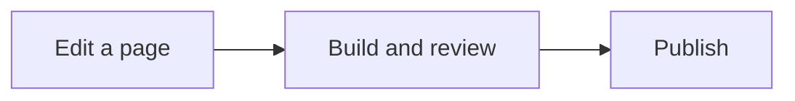

# Writing diagrams

Use **Mermaid** for code flow, message sequences and state transitions in this
guide. Keep its text alongside the explanation so a future maintainer can
review changes in Git. The diagram should answer one question that its
surrounding paragraph makes explicit.

## Connect the diagram to implementation

Open a technical chapter with a diagram that answers its main implementation
question. Follow it with a small table mapping the components to actual files
and functions/classes. Explain the inputs, outputs and conditions in the same
order as the graph, then give design reasons, failure cases and validation.
The [planning chapter](../manipulation/planning.md) demonstrates this structure.

Keep the graph meaningful as plain Mermaid source: use descriptive node labels
and name what crosses important edges. Both readers and agents can use those
relationships. Code links supply exact locations; prose supplies assumptions
and limits that a box or arrow cannot express fully.

Use the [code index](code-index.md) for exact source availability. Do not draw
a rejected experiment as the current runtime, or merge two coordinators merely
because they use the same planner. A component diagram is not a startup
sequence; state explicitly which question it answers.

## Choose the diagram for the question

| Question | Mermaid type | Example in the G1 work |
|---|---|---|
| What information flows between components? | `flowchart` | Observations, planner inputs and controller output |
| Who sends what, and in what order? | `sequenceDiagram` | Controller/worker exchange or watchdog startup |
| Which transitions are allowed? | `stateDiagram-v2` | Task phases and normal versus fault recovery |

Separate diagrams when the question changes. A runtime path, an offline
analysis path and an ownership state machine usually need separate views.
For physical geometry, use a CAD view or annotated photograph when it conveys
mounting surfaces, axes or dimensions more accurately than boxes and arrows.

## Write ordinary Markdown

The MyST configuration recognizes standard Mermaid fences. For example:

````markdown

````

This syntax is also understood by GitHub's Markdown renderer. GitHub controls
its own Mermaid version, so check compatibility before using newer syntax.
The Sphinx renderer version is pinned in `docs/conf.py`.

## Keep the explanation readable

Use short labels with concrete nouns or verbs. Label arrows when their meaning
is otherwise ambiguous: a measured state, a command, an acknowledgement and a
recovery request are different relationships. Use a line break within a label
when needed, as in `"Observe robot<br/>and scene"`.

Start with roughly three to seven nodes. If an overview needs many more,
split it and link to the detailed chapter. Keep the main direction consistent
and avoid wrapping feedback arrows around an entire page merely to include
every relationship.

Add `accTitle` and `accDescr` for an accessible title and description. Explain
the important relationship in the surrounding prose too. Do not use color
alone to distinguish success from failure, measured from commanded, or
simulation from hardware.

The site supplies a neutral light theme, a dark theme, readable sizing and
an **Expand** control. In-page graphs retain their intrinsic dimensions;
the expanded viewer fits the complete graph. Narrow screens scroll wide diagrams horizontally.
Keep appearance settings in `docs/conf.py` and `assets/stylesheets/extra.css`
instead of repeating a custom theme in each diagram.

## Verify the rendered result

Run the normal strict Sphinx build, then open the changed page in a browser.
Mermaid renders in JavaScript, so a successful Sphinx build alone does not
prove that a diagram parses or lays out correctly. Check labels, arrow
endpoints, light/dark mode, a narrow viewport, and the Expand/Escape controls.

Do not describe an offline check as a physical transition that was tested.
When drawing control or recovery sequences, trace the exact source ordering
and preserve the conditions in the corresponding chapter.

References: [Mermaid syntax](https://mermaid.js.org/intro/syntax-reference.html),
[accessibility](https://mermaid.js.org/config/accessibility.html), and
[GitHub Mermaid support](https://docs.github.com/en/get-started/writing-on-github/working-with-advanced-formatting/creating-diagrams).
