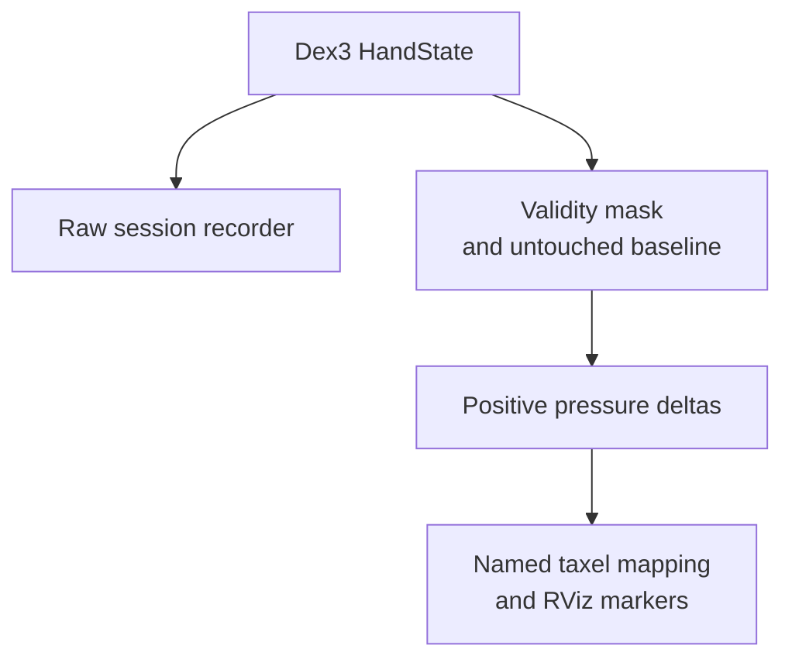

# Exploring Dex3 pressure sensing

The pressure tools read Dex3 state, preserve raw samples and turn valid baseline-relative counts into a spatial display. They do not publish hand commands. The physical mapping study used the right hand marked `214-R-T`.



## Follow the code

| Diagram component | Code entry point | Responsibility |
|---|---|---|
| Raw recording | [session_recorder.py](https://github.com/sri299792458/dex3_pressure_tools/blob/e0b706df507160799b70732c7cc3244924ce8f5e/dex3_pressure_tools/session_recorder.py#L56) · `Dex3PressureSessionRecorder._state_callback` | Store pressure arrays, receipt times and motor positions. |
| Message processing | [pressure_visualizer.py](https://github.com/sri299792458/dex3_pressure_tools/blob/e0b706df507160799b70732c7cc3244924ce8f5e/dex3_pressure_tools/pressure_visualizer.py#L263) · `Dex3PressureVisualizer._state_callback` | Extract slots, retain validity and compute positive baseline-relative deltas. |
| Untouched baseline | [pressure_visualizer.py](https://github.com/sri299792458/dex3_pressure_tools/blob/e0b706df507160799b70732c7cc3244924ce8f5e/dex3_pressure_tools/pressure_visualizer.py#L292) · `Dex3PressureVisualizer._finish_baseline` | Estimate per-slot median and noise; choose the display threshold. |
| Spatial display | [pressure_visualizer.py](https://github.com/sri299792458/dex3_pressure_tools/blob/e0b706df507160799b70732c7cc3244924ce8f5e/dex3_pressure_tools/pressure_visualizer.py#L334) · `Dex3PressureVisualizer._publish_timer_callback` | Publish mapped markers and optional visualization joint state. |

The raw branch retains information that a color overlay discards. The display depends on both a valid untouched baseline and a physically checked taxel map. Counts are not forces, and this passive path is separate from the later joint-based grasp-contact gate.

## Seeing the pressure display

<figure class="research-video">
  <video controls playsinline preload="none" poster="../_static/dex3-tactile-rviz-demo.jpg" width="1280" height="720" aria-label="Dex3 tactile visualization in RViz" aria-describedby="tactile-demo-caption">
    <source src="https://github.com/sri299792458/g1-research-docs/releases/download/media-2026-09-21/dex3-tactile-rviz-demo.mp4" type="video/mp4">
    Your browser cannot play this video. Use the download link below.
  </video>
  <figcaption id="tactile-demo-caption">Taxel colors change at different locations on the rendered Dex3 hand. This is the RViz display; the physical contact producing the readings is outside the frame. Colors represent pressure-count changes, not calibrated forces. Silent, 11 seconds.</figcaption>
  <p class="video-download"><a href="https://github.com/sri299792458/g1-research-docs/releases/download/media-2026-09-21/dex3-tactile-rviz-demo.mp4">Download the tactile demo (MP4)</a></p>
</figure>

Follow a changing cell back to the named taxel mapping and the raw slot. A
display can look plausible even when a slot is misplaced or its baseline was
captured during contact; the retained raw samples let you investigate that.

## Start with the raw message

`unitree_hg/msg/HandState` contains nine pressure groups with 12 cells each:
108 raw pressure slots per hand. Each group also contains temperature values,
`lost` and `reserve` fields. On the inspected right hand, 33 slots responded
as taxels and 75 remained exactly at the unused value `30000`.

| Group ID | Active cell indices |
|---|---|
| 0, 2, 4, 6, 7, 8 | 0, 2, 9, 11 |
| 1, 3, 5 | 3, 6, 8 |

An initial 45-sample, 4.87 s audit established the layout. A later 210-sample,
20 s untouched baseline confirmed that every inactive slot stayed at `30000`.
The map begins from an external diagram, but repeated live touches are the
authority for this particular hand's placement.

## Topic rate changes what you can observe

The source measured approximately 9.1 Hz on `/lf/dex3/right/state` and
750–770 Hz on `/dex3/right/state` in short runs. The lower rate was useful
for guided mapping and RViz; fast taps or slip need the higher-rate stream.
Recheck rates on the actual firmware and network rather than treating these
historical measurements as specifications.

The tools subscribe to state and publish visualization markers plus optional
joint states. They do not publish hand commands. After following the source
workspace setup, a passive raw observation is:

```bash
ros2 topic echo --once --full-length /dex3/right/state unitree_hg/msg/HandState
```

The default visualizer uses the lower-rate topic:

```bash
ros2 launch dex3_pressure_tools dex3_pressure_visualizer.launch.py
```

If an existing launch already owns robot description and joint-state defaults,
use the documented flags to avoid duplicate publishers. See the repository
README and `docs/LAB_PROTOCOLS.md` for the complete launch context.

## Baseline and display model

```text
valid = finite(raw) and abs(raw - 30000) > 1000
baseline = median(valid untouched samples)
noise = p99(abs(untouched samples - baseline))
delta = max(raw - baseline, 0)
```

The untouched rerun had median/max standard deviation about 5.9/7.5 counts
and median/max p99 absolute drift 16/24 counts. No active taxel drifted by
50 counts or more. That supported a 50-count visualization threshold on this
hand under these conditions.

The free-touch session contained 1,274 samples over 139.7 s. Across active
taxels, peak delta had median 2,280 and maximum 13,800 counts; 22/33 exceeded
500. A 500-count “definite touch” display threshold was conservative relative
to those observations, not a force threshold in newtons.

Rebaseline while untouched. Do not let an existing contact become the zero
reference. Preserve raw arrays and validity masks alongside the display; a
color overlay alone cannot reveal an unused slot or baseline mistake.

## Mapping the fingers

Physical RViz checks established right-hand motor order as thumb 0/1/2,
middle 0/1, index 0/1. The explicit 33-taxel YAML stores marker poses on named
links. A misplaced visual taxel should be changed after repeated touch evidence,
not simply because a mirrored diagram looks more plausible.

Later cube manipulation explored pressure as required grasp evidence and
replaced that gate with opposed joint shortfall relative to measured empty
close. That result does not invalidate the sensor study. It says pressure
was not a reliable required signal for those cube contacts and placement.

Evidence: `dex3_pressure_tools` README, observations, signal model and mapping
documents at the [recorded revision](../reference/sources.md).

## Checks and evidence to inspect

Use the repository’s `docs/OBSERVATIONS.md`, `docs/MATH_AND_SIGNALS.md` and `docs/MAPPING_AND_MARKERS.md` at the [recorded revision](../reference/sources.md). The audit and touch results below are for the inspected right hand; no new tactile run was performed for the guide.
