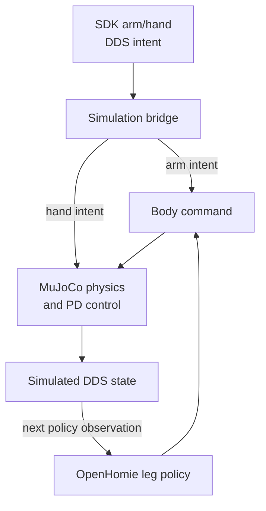

# The initial MuJoCo digital twin

The initial G1Pilot MuJoCo backend accepts SDK-style arm and hand intent while an OpenHomie policy supplies the leg commands. It does not reproduce Unitree’s proprietary walking controller.

## Follow the code

| Diagram component | Code entry point | Responsibility |
|---|---|---|
| DDS bridge | [mujoco_plant.py](https://github.com/sri299792458/g1pilot/blob/6b5af59b109e2ee687920fdf66ded6182725e945/g1pilot/simulation/mujoco_plant.py#L280) · `G1PilotUnitreeBridge` | Latch incoming arm/hand intent and publish simulated state. |
| Body command | [mujoco_plant.py](https://github.com/sri299792458/g1pilot/blob/6b5af59b109e2ee687920fdf66ded6182725e945/g1pilot/simulation/mujoco_plant.py#L631) · `G1PilotMujocoPlant.build_body_command` | Combine leg-policy output with nominal or received upper-body intent. |
| Physics step | [mujoco_plant.py](https://github.com/sri299792458/g1pilot/blob/6b5af59b109e2ee687920fdf66ded6182725e945/g1pilot/simulation/mujoco_plant.py#L592) · `G1PilotMujocoEnv.sim_step` | Apply body/hand torques and advance the model. |
| Loop ordering | [mujoco_plant.py](https://github.com/sri299792458/g1pilot/blob/6b5af59b109e2ee687920fdf66ded6182725e945/g1pilot/simulation/mujoco_plant.py#L671) · `G1PilotMujocoPlant.run` | Step physics, publish state, update policy, then render. |
| Policy observation | [openhomie_policy.py](https://github.com/sri299792458/g1pilot/blob/6b5af59b109e2ee687920fdf66ded6182725e945/g1pilot/simulation/openhomie_policy.py#L45) · `compute_openhomie_observation` | Build the external policy’s input representation. |
| G1Pilot launch wiring | [mujoco_openhomie_manipulation.launch.py](https://github.com/sri299792458/g1pilot/blob/6b5af59b109e2ee687920fdf66ded6182725e945/launch/mujoco_openhomie_manipulation.launch.py#L21) · `_launch_setup` | Wire state/manipulation nodes to the selected interface and domain. |

Use the pinned July development snapshot in these links. The author confirmed this implementation and its demos are the full extent of the work; there are no later MuJoCo development notes. Model, transport and watchdog behavior must be assessed separately from the later tabletop controller.

## Model and control loop

The inspected model has 41 actuators: 12 legs, waist yaw, 14 arms and 14 fingers.
Waist roll/pitch are fixed, matching the early mechanically locked configuration.
The DDS body state still follows the 29-slot logical layout, leaving those
fixed coordinates in their expected positions.

Physics uses a 0.002 s timestep. The lower-body policy runs every ten physics
steps, with six stacked 76-element observations, or 456 inputs. The external
OpenHomie model is supplied as an ONNX/TorchScript artifact; it is not an
identified copy of the manufacturer's policy.

The arm/hand plant applies PD plus feedforward and holds a nominal pose before
the first command. Commands are then latched. The inspected backend does not
implement a command-age watchdog, so stopping a publisher does not reproduce
the later hardware recovery behavior.

## Interface coverage

| Direction | DDS contract |
|---|---|
| Into simulation | Arm SDK intent, left/right hand commands |
| Out of simulation | Body LowState, hand states, secondary IMU, wireless controller |

The simulator owns physics and lower-body policy execution. G1Pilot can retain
its higher-level arm/Dex3 interface. The initial backend does not establish a
complete seated `lowcmd` service-release lifecycle or standing firmware blend
semantics.

The activated hand model derives from the revision-1 GR00T fingers, with
documented damping 0.05. Selecting a different visual hand model does not
automatically replace the physical MuJoCo XML. Rendering and dynamics must be
checked as separate configuration paths.

## Isolation and reproducibility

The simulation environment defaults to loopback and DDS domain 1, but preserves
existing overrides. ROS middleware and Unitree SDK transport have separate
configuration mechanisms: the inspected setup used Fast DDS for ROS and
Cyclone DDS for the SDK. Before running a simulation, explicitly verify both
transport paths against the source environment script; a default in one layer
does not prove isolation of the other.

Pin the G1Pilot revision, generated XML, policy file and model dependencies.
Stand is the default policy mode. Available walking arguments are not evidence
of a validated walking envelope.

Static inspection found 41 actuators and 89 sensor elements in the generated
XML. An older diagnostic expected 29 actuators/95 sensors/113 values, while
the inspected model had 41/89/107. That diagnostic needs reconciliation before
being advertised as a passing verification command. No simulator or diagnostic
was run while writing this guide.

## Demonstrations

The [July 1 media release](https://github.com/sri299792458/g1pilot/releases/tag/mujoco-demo-media-2026-07-01)
contains an RViz/arm demo and a Dex3 open/close demo. These are simulation assets,
not footage of the physical robot. Their review status and stable links are in
the [media catalog](../reference/media.md).

The useful contribution is an initial SDK-compatible development path with
explicit model and controller boundaries. Contact identification, hardware
timing equivalence and validation of the later tabletop pipeline remain beyond
the demonstrated scope.

Evidence: G1Pilot `dev` at `6b5af59b109e2ee687920fdf66ded6182725e945`,
README, backend, XML generators and diagnostic. [Source identities](../reference/sources.md).

## Checks and evidence to inspect

The backend, launch path, generated XML and diagnostic were inspected statically. The older diagnostic’s actuator/sensor expectations disagree with the inspected model, as detailed below. Neither the simulator nor that diagnostic was run for this documentation. Demo media remain linked with their review status.
