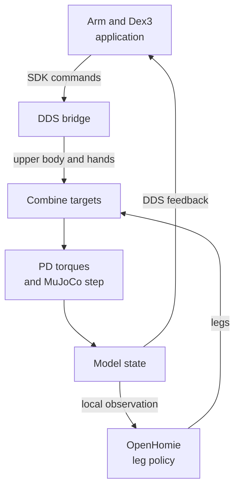

# The initial MuJoCo digital twin

The goal was to develop arm and Dex3 tooling against a simulated G1 through
the same Unitree SDK message interfaces used by the application. The work adds
a MuJoCo backend to the G1Pilot fork: it receives arm/hand commands, advances
physics, and publishes simulated robot state. OpenHomie's pretrained policy
controls the legs because Unitree's proprietary locomotion controller is not
available inside this simulator.

The backend builds on [Hucebot's G1Pilot](https://github.com/hucebot/g1pilot)
application, GR00T's G1/hand model, and OpenHomie's policy. The contribution here
is their integration through the simulated SDK command/state path.

This chapter covers that initial backend and its arm/hand demonstrations.
The later tabletop controller has its own [ownership and recovery lifecycle](../control/ownership.md);
the cube-stacking pipeline has not been validated against this backend.

## Choose a reading path

- To run the arm/hand demonstration, use [setup](#set-up-the-pinned-version)
  and [launch instructions](#run-the-arm-and-hand-demonstration).
- To change the simulator, read the command/feedback map below, the
  [bridge contracts](#command-and-state-contracts) and [code entry points](#follow-the-code).
- To judge what was demonstrated, see the [videos](#demonstrations) and
  [limits](#limits-and-useful-extension-points).

The diagram shows the feedback loop: OpenHomie updates the legs from simulated
state while the application supplies upper-body and hand intent through DDS.
The plant combines those inputs before stepping physics.



## What the backend owns

The **plant** owns the simulation loop and leg-policy execution. The **environment**
owns MuJoCo's model/data and computes torques. The **bridge** stores SDK
commands and publishes state; it does not step physics. This separation gives
an extension a clear place to change dynamics, transport or policy scheduling.

The inputs are targets and gains. Both body and hand actuation use:

```text
torque = feedforward + kp × (target_position − position)
                     + kd × (target_velocity − velocity)
```

Before any arm command arrives, waist yaw and the arms have zero-position
targets with `kp=100`, `kd=0.5`. The default hand targets are zero with
`kp=1.5`, `kd=0.1`. After receipt, the bridge keeps the latest commands.
**There is no command-age watchdog in this backend.** Stopping an application
publisher leaves its last intent in effect; it does not trigger the physical
robot's later recovery procedure.

### Command and state contracts

| Direction | SDK DDS topic | Implemented meaning |
|---|---|---|
| In | `rt/arm_sdk` | `LowCmd_`; the plant reads waist-yaw and arm targets/gains/feedforward. Legs come from OpenHomie. |
| In | `rt/dex3/left/cmd`, `rt/dex3/right/cmd` | Seven-motor `HandCmd_` per hand. |
| Out | `rt/lowstate` | Body position, velocity, acceleration and actuator force, base orientation/velocity/acceleration, and simulation-time tick. |
| Out | `rt/dex3/left/state`, `rt/dex3/right/state` | Hand joint position and velocity; no tactile-pressure simulation is implemented here. |
| Out | `rt/secondary_imu` | Torso orientation and angular velocity populated by the bridge. |
| Out | `rt/wirelesscontroller` | Default controller message; this loop does not populate live joystick input. |

These are SDK channels, distinct from ROS application topics such as
`/g1pilot/dx3/left/command`. Matching message types does not reproduce all
firmware behavior: the plant reads the numeric command fields without implementing
the manufacturer's arm-blend weight, motor-mode protocol or service handback.
There is no `rt/lowcmd` subscriber for the later seated direct-control path.

### Loop and policy timing

Each iteration builds the body command, applies body/hand torques, steps physics,
publishes the resulting state, and updates the leg policy when its interval is
due. The policy reads this state directly inside the plant, without a DDS round trip.
Its new output affects subsequent steps.

The defaults are a **0.002 s physics step** and one policy update every **10 steps**:
500 Hz physics and 50 Hz policy in simulation time. The loop sleeps when ahead
of its timestep; these settings are not a measured wall-clock performance result.

One policy observation contains 76 values: velocity command (3), height command
(1), angular velocity (3), projected gravity (3), active body positions (27),
velocities (27), and previous leg actions (12). Six observations form the
456-value input; the 12 outputs become leg targets through
`target = default_angles + 0.25 × action`. The wrapper accepts ONNX or
TorchScript and checks input/output widths. Standing is the default;
exposed walking arguments do not establish a validated walking envelope.

## Model choices that must stay consistent

The generated [MuJoCo XML](https://github.com/sri299792458/g1pilot/blob/dadd88f985bb5772f279019b8882208ec59ae4f0/description_files/xml/openhomie_g1_29dof.xml)
has **41 actuators**: 12 legs, waist yaw, 14 arms and 14 fingers. Waist roll and
pitch are fixed, matching the early mechanically locked configuration.
Body arrays retain the logical slots 0–28, with fixed coordinates at slots 13
and 14. Actuator indices therefore cannot be used interchangeably with SDK motor IDs.
The plant maps actuator names to motor slots explicitly.

The XML generator starts from the GR00T revision-1 activated-finger model,
removes the two waist joints, and rebuilds actuators and sensors. Its validation
checks finger damping of `0.05`; this is an inherited model setting, not a
measurement of the lab hand. The simulation's named finger order is thumb,
index, middle. Check the target driver's mapping before reusing these arrays
with another hand interface.

Three model selections serve different purposes:

| Consumer | Default model | What changing it affects |
|---|---|---|
| MuJoCo plant | `description_files/xml/openhomie_g1_29dof.xml` | Physics, contacts and actuators; selected with plant `--xml`. |
| RViz/state visualization | `g1_29dof_lock_waist_dx3.urdf` | Visible robot and hand joint transforms; selected by launch `hand_model:=dex3`. |
| OpenSoT solver | `g1_29dof_lock_waist.urdf` | Arm kinematics/collision model; the launch keeps Dex3 fingers out of this solver model. |

Changing `hand_model` to `dummy` changes the ROS visual/controller path. It
does **not** replace MuJoCo's physical XML. Similarly, a matching pose in RViz
does not verify finger contacts or inertial parameters.

## Set up the pinned version

The commands below follow the inspected implementation. They have not been
rerun as a fresh-machine installation for this guide. Use a separate workspace
from tabletop control, with ROS and Git LFS installed. Match Ubuntu/ROS to the
source scripts (Ubuntu 22.04/Humble or 24.04/Jazzy).

```bash
git clone --branch dev https://github.com/sri299792458/g1pilot.git g1pilot-sim
cd g1pilot-sim
git switch --detach dadd88f985bb5772f279019b8882208ec59ae4f0
git lfs pull
```

The [system dependency script](https://github.com/sri299792458/g1pilot/blob/dadd88f985bb5772f279019b8882208ec59ae4f0/scripts/setup_system_deps.sh)
lists the remaining system packages and assumes ROS is already installed.
The [user workspace script](https://github.com/sri299792458/g1pilot/blob/dadd88f985bb5772f279019b8882208ec59ae4f0/scripts/setup_user_workspace.sh)
creates the Python environment, builds OpenSoT dependencies, installs the SDK,
and builds the ROS package. For a simulation workspace, its options
let you omit the physical camera and LiDAR integrations:

```bash
export ROS_DISTRO=humble  # use jazzy on the matching ROS installation
export G1PILOT_WS="$HOME/g1pilot_sim_${ROS_DISTRO}_ws"
scripts/setup_user_workspace.sh \
  --skip-livox --skip-realsense-python --skip-teleimager-client
```

Keep this `ROS_DISTRO`/`G1PILOT_WS` selection in each subsequent terminal. The
scripts pin some dependencies but not all upstream revisions; record the
resolved versions when reproducing the environment. A plain `pip install` of
G1Pilot does not install this native/ROS stack.

### Download the policy and reachability map

OpenHomie publishes the pretrained policy as
[`HomieDeploy/deploy.onnx`](https://github.com/InternRobotics/OpenHomie/blob/33071f79f1884bb122bd45631c8c60d61dac1eb8/HomieDeploy/deploy.onnx).
Download it and set the path used by the plant:

```bash
mkdir -p ../reference_repos/OpenHomie/HomieDeploy
curl --fail --location \
  --output ../reference_repos/OpenHomie/HomieDeploy/deploy.onnx \
  https://raw.githubusercontent.com/InternRobotics/OpenHomie/33071f79f1884bb122bd45631c8c60d61dac1eb8/HomieDeploy/deploy.onnx
export OPENHOMIE_POLICY_PATH="$(realpath ../reference_repos/OpenHomie/HomieDeploy/deploy.onnx)"
```

This uses the repository layout the simulator searches by default. An existing
OpenHomie clone works too: point `OPENHOMIE_POLICY_PATH` at its policy file.
The URL pins the upstream copy checked for this guide. This simulation path
loads the pretrained file; it does not require training a policy or running
OpenHomie's physical-robot deployment programs.

The **reachability map** belongs to the OpenSoT arm application. Download it
before rebuilding the package so it is included in the installed share directory:

```bash
mkdir -p config/reachability
curl --fail --location \
  --output config/reachability/g1_29dof_lock_waist_reachability.npz \
  https://github.com/sri299792458/g1pilot/releases/download/mujoco-demo-media-2026-07-01/g1_29dof_lock_waist_reachability.npz
scripts/build_workspace.sh --packages-up-to g1pilot
```

The generated XML is tracked; recreating it additionally requires the upstream
GR00T source model. Loading the tracked model needs its referenced mesh files,
with Git LFS objects materialized.

## Run the arm and hand demonstration

### Prepare each terminal

From the pinned checkout, set the same workspace/distro and policy path as
above, then explicitly select the simulation interface and domains:

```bash
export ROS_DOMAIN_ID=1
export G1_UNITREE_DOMAIN_ID=1
export UNITREE_MUJOCO_DOMAIN_ID=1
export G1PILOT_ROS_RMW=rmw_fastrtps_cpp
source scripts/source_g1.sh sim lo
source "$G1PILOT_WS/install/setup.bash"
ros2 pkg prefix g1pilot
```

Check that the package prefix belongs to the intended simulation workspace and
the environment summary reports `G1_PROFILE=sim`, `G1_INTERFACE=lo`, and domain
1. The script preserves existing domain overrides, so merely sourcing `sim`
after using a hardware terminal is insufficient. If it reports disabled
loopback multicast, its indicated host setting is `sudo ip link set lo multicast on`.

ROS uses Fast DDS here; the Unitree SDK uses Cyclone DDS with the script's
loopback configuration. These are separate transport configurations. The
plant's `--interface` and `--domain-id` arguments are explicit below because
its argument parser has its own defaults.

### Start the plant and application

In terminal 1, start MuJoCo with the standing policy:

```bash
ros2 run g1pilot g1pilot_mujoco_plant \
  --interface lo --domain-id 1 --mode stand \
  --policy-path "$OPENHOMIE_POLICY_PATH"
```

The source prints the loaded policy, model shape (`nu=41`, body slots 29,
hand slots 7), and timestep. Before the application sends arm commands it
reports nominal upper-body holding. After ten physics steps it reports the
first policy update. These are expected source-defined messages, not a saved
passing run from this documentation session.

In terminal 2, after the same environment setup:

```bash
ros2 launch g1pilot mujoco_openhomie_manipulation.launch.py \
  interface:=lo domain_id:=1 hand_model:=dex3
```

This starts the state/RViz and manipulation nodes; **the launch does not start
the plant**. It enables SDK command publication even though the OpenSoT
`use_robot` setting is false. The state subscriber uses `use_robot=true` to
read DDS feedback from the plant. Those flags describe node behavior; the
selected interface/domain determines where the messages go.

In a third prepared terminal, enable the global arm gate:

```bash
ros2 topic pub --once /g1pilot/arms/enabled std_msgs/msg/Bool '{data: true}'
```

Enable each arm marker from its RViz context menu, then move a marker. Inspect
both the RViz goal and MuJoCo response. The reachability gate can reject a goal;
an enabled marker alone does not establish a reachable target. The plant logs
receipt of its first `rt/arm_sdk` command when that path becomes active.

For the left simulated hand, issue each command separately and observe the
response before the next:

```bash
ros2 topic pub --once /g1pilot/dx3/left/command std_msgs/msg/String '{data: close}'
ros2 topic pub --once /g1pilot/dx3/left/command std_msgs/msg/String '{data: open}'
```

The right-hand command topic replaces `left` with `right`. Check incoming
body/hand ROS joint states and the final `/joint_states` view when diagnosing
a static RViz model. Stop both the application launch and the plant when
finished; stopping only the publisher does not clear latched intent.

### Headless inspection

Run this **instead of** the graphical plant for an eight-second wall-clock run:

```bash
ros2 run g1pilot g1pilot_mujoco_plant \
  --interface lo --domain-id 1 --policy-path "$OPENHOMIE_POLICY_PATH" \
  --headless --duration 8
```

Inspect the reported simulation time, base position, velocity norm and control
norm. This is a bounded observation command: normal exit does not assert that
the robot remained upright or tracked an arm goal. `--allow-zero-policy` is a
diagnostic fallback for nominal leg targets, not policy-controlled standing.

## Demonstrations

<figure class="research-video">
  <video controls playsinline preload="none" poster="../_static/mujoco-rviz-short-demo.jpg" width="1280" height="720" aria-label="RViz and the G1 MuJoCo model during arm-pose changes" aria-describedby="mujoco-demo-caption">
    <source src="https://github.com/sri299792458/g1-research-docs/releases/download/media-2026-09-21/mujoco-rviz-short-demo.mp4" type="video/mp4">
    Your browser cannot play this video. Use the download link below.
  </video>
  <figcaption id="mujoco-demo-caption">RViz on the left and MuJoCo on the right during arm-pose changes. This illustrates the application-to-simulator interface; it does not measure tracking error. Silent, 10 seconds.</figcaption>
  <p class="video-download"><a href="https://github.com/sri299792458/g1-research-docs/releases/download/media-2026-09-21/mujoco-rviz-short-demo.mp4">Download the short MuJoCo/RViz demo (MP4)</a></p>
</figure>

The July release also contains a [34-second arm demo](https://github.com/sri299792458/g1pilot/releases/download/mujoco-demo-media-2026-07-01/g1pilot-mujoco-rviz-arm-demo.mp4)
and an [18-second Dex3 open/close demo](https://github.com/sri299792458/g1pilot/releases/download/mujoco-demo-media-2026-07-01/g1pilot-mujoco-dex3-open-close-demo.mp4).
Sampled frames show arm-pose changes beside RViz and a hand response to the
terminal's open/close commands. These are simulation recordings. Their hashes,
dimensions and review scope are in the [media catalog](../reference/media.md#other-available-mujoco-videos).

## Limits and useful extension points

The result is an initial SDK-facing simulator with arm/hand demonstrations.
No quantitative tracking, contact-identification, hardware-timing or locomotion
equivalence result is established by the available demos.

| When extending… | Preserve or check… |
|---|---|
| The model | Actuator-name → SDK-slot mapping, locked waist coordinates, hand order, meshes and the separate visual/solver models. |
| The leg policy | Observation ordering/scales, six-observation history, 456 inputs, 12 actions and update timing. Record the policy hash. |
| The command bridge | An explicit command-expiry/stop contract. The current bridge has no age timeout and numeric torque inputs do not emulate firmware ownership. |
| Simulated sensors | The actual fields populated by `prepare_obs` and `publish_lowstate`; a declared XML sensor or DDS field is not proof of a faithful measurement. |
| A tabletop connection | A deliberate adapter and lifecycle validation: the current plant accepts arm SDK intent, not the seated `lowcmd` ownership/recovery path. |

The generated XML was inspected statically: **41 actuators, 89 sensor elements,
107 sensor values**. The generator's [`validate_with_mujoco`](https://github.com/sri299792458/g1pilot/blob/dadd88f985bb5772f279019b8882208ec59ae4f0/scripts/generate_openhomie_g1_29dof_xml.py#L335)
expects this shape. The older
[`diagnose_openhomie_mujoco_baseline.py`](https://github.com/sri299792458/g1pilot/blob/dadd88f985bb5772f279019b8882208ec59ae4f0/scripts/diagnose_openhomie_mujoco_baseline.py)
instead expects 29 actuators, 95 sensors and 113 values in its generated-model
comparison. Reconcile that check before using it as a verification result.

The code, model structure and sampled demo frames were reviewed for this
chapter. No simulator, model generator or diagnostic was executed for the guide.
A clean-workspace reproduction and measured simulation results remain useful
next steps for extending this initial backend.

## Follow the code

All links below refer to G1Pilot `dev` at
[`dadd88f`](https://github.com/sri299792458/g1pilot/tree/dadd88f985bb5772f279019b8882208ec59ae4f0).
Start with the plant's `run()` method, then follow a command through to the
state returned to the application.

| Component | Entry point | Responsibility |
|---|---|---|
| Main loop | [mujoco_plant.py · `G1PilotMujocoPlant.run`](https://github.com/sri299792458/g1pilot/blob/dadd88f985bb5772f279019b8882208ec59ae4f0/g1pilot/simulation/mujoco_plant.py#L671) | Order command assembly, physics, state publication and policy updates. |
| DDS bridge | [mujoco_plant.py · `G1PilotUnitreeBridge`](https://github.com/sri299792458/g1pilot/blob/dadd88f985bb5772f279019b8882208ec59ae4f0/g1pilot/simulation/mujoco_plant.py#L280) | Store incoming commands and pack outgoing state. |
| Command assembly | [mujoco_plant.py · `build_body_command`](https://github.com/sri299792458/g1pilot/blob/dadd88f985bb5772f279019b8882208ec59ae4f0/g1pilot/simulation/mujoco_plant.py#L631) | Combine policy leg targets with waist-yaw/arm intent. Hands have a separate command path. |
| Physics | [mujoco_plant.py · `G1PilotMujocoEnv.sim_step`](https://github.com/sri299792458/g1pilot/blob/dadd88f985bb5772f279019b8882208ec59ae4f0/g1pilot/simulation/mujoco_plant.py#L592) | Compute body/hand torques and call `mujoco.mj_step`. |
| Policy input | [openhomie_policy.py · `compute_openhomie_observation`](https://github.com/sri299792458/g1pilot/blob/dadd88f985bb5772f279019b8882208ec59ae4f0/g1pilot/simulation/openhomie_policy.py#L45) | Construct one observation; the plant stacks history and schedules inference. |
| Application wiring | [mujoco_openhomie_manipulation.launch.py · `_launch_setup`](https://github.com/sri299792458/g1pilot/blob/dadd88f985bb5772f279019b8882208ec59ae4f0/launch/mujoco_openhomie_manipulation.launch.py#L21) | Start the ROS state, RViz, OpenSoT and Dex3 path on the selected DDS interface/domain. |
| Arm intent | [opensot_solver.py · `control_loop`](https://github.com/sri299792458/g1pilot/blob/dadd88f985bb5772f279019b8882208ec59ae4f0/g1pilot/manipulation/opensot_solver.py#L938) | Turn enabled arm goals into `rt/arm_sdk` commands. |
| Hand intent | [dx3_hand.py · `_apply_named_command`](https://github.com/sri299792458/g1pilot/blob/dadd88f985bb5772f279019b8882208ec59ae4f0/g1pilot/manipulation/dx3_hand.py#L261), [`publish_once`](https://github.com/sri299792458/g1pilot/blob/dadd88f985bb5772f279019b8882208ec59ae4f0/g1pilot/manipulation/dx3_hand.py#L325) | Convert named hand commands into joint targets and publish smoothed intent. |
| ROS state | [robot_state.py · `callback_lowstate`](https://github.com/sri299792458/g1pilot/blob/dadd88f985bb5772f279019b8882208ec59ae4f0/g1pilot/state/robot_state.py#L122) | Convert body DDS feedback to ROS joint and IMU messages. |
| Physical model | [generate_openhomie_g1_29dof_xml.py · `generate`](https://github.com/sri299792458/g1pilot/blob/dadd88f985bb5772f279019b8882208ec59ae4f0/scripts/generate_openhomie_g1_29dof_xml.py#L316) | Generate the locked-waist model with active Dex3 fingers, actuators and sensors. |
