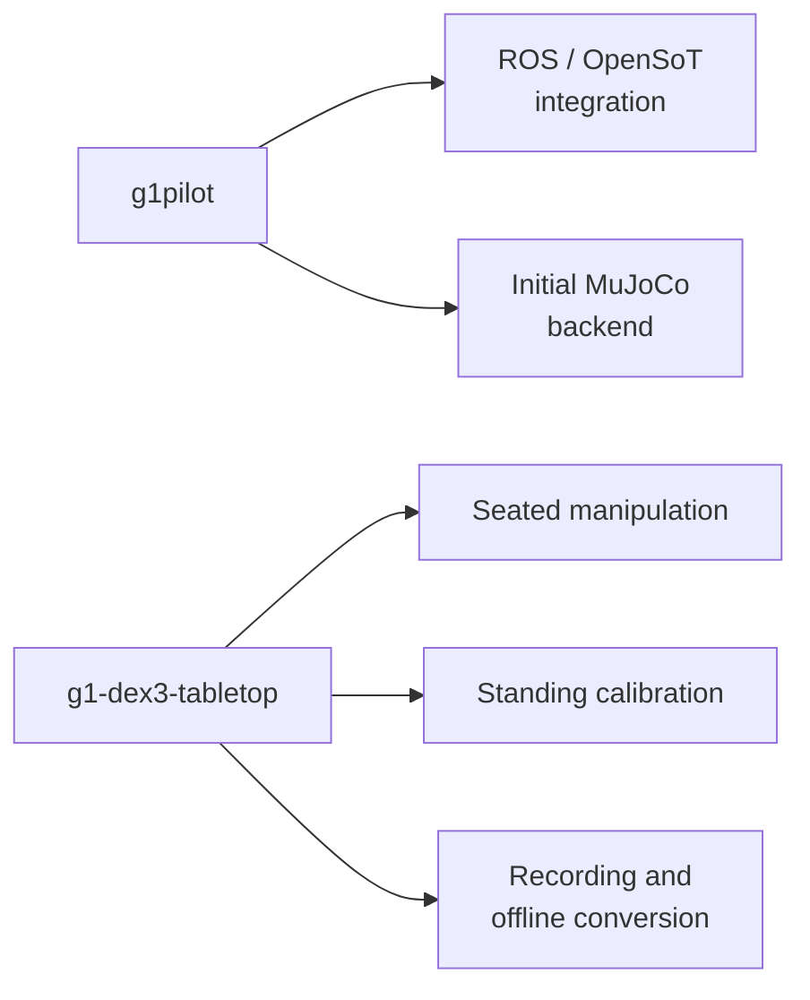

# System map and code entry points

Choose the execution path first. G1Pilot, its initial simulator, and the later
tabletop workflows share robot interfaces but do not share a complete control
lifecycle. A result from one does not automatically validate another.



## Enter through the task coordinator

| Path | First code to read | Then follow |
|---|---|---|
| Single-cube trajectory task | `hardware_tabletop.py::run_tabletop` | [Perception](../perception/object-pose.md), [camera state](../perception/state-estimation.md), [planning](../manipulation/planning.md), [task lifecycle](../manipulation/tasks.md) |
| Direct two-cube stack | `hardware_stack.py::run_stack` | Endpoint candidate intersection, complete transfer planning, contact checks and retained episodes in [stacking](../manipulation/tasks.md#direct-two-cube-transfer) |
| Standing bilateral calibration | `hardware_bilateral_calibration.py::run_collect_bilateral_calibration` | [Control ownership](../control/ownership.md), [collection and fitting](../calibration/workflow.md), then [results](../calibration/results.md) |
| Initial G1Pilot integration | `RobotState`, `G1CollisionAvoidanceNode`, `DX3Controller` | [Launch/mode boundaries and source links](../control/g1pilot.md) |
| Initial MuJoCo backend | `G1PilotMujocoPlant.run` | [DDS bridge, command assembly and policy loop](../simulation/mujoco.md) |
| Passive tactile study | `Dex3PressureVisualizer` | [Raw recording, baseline and spatial mapping](../sensing/pressure.md) |
| Offline grasp generation | `run_atlas`, `build_shortlist` | [Frame contract and qualification](../manipulation/grasp-atlas.md), then [support and assembly](../manipulation/assembly.md) |
| Raw data to LeRobot | `RawEpisodeRecorder`, `convert_episode` | [Lifecycle, completeness and alignment](../data/recording.md) |

Each linked chapter maps these names to exact file locations. The
[code index](../reference/code-index.md) resolves pinned public versions and their branch boundaries. [Setup](setup.md) describes the separate environments.

## Preserve the interfaces when extending a component

| Boundary | Producer → consumer | What must survive |
|---|---|---|
| Object observation | Detector → planner | Object profile, rectified camera model, pose convention, accepted image hashes and measured snapshot |
| Camera propagation | Visual anchor/body state → boundary replan | Matching timestamps, reference frame and explicit fixed-origin assumption |
| Grasp candidate | Generator/qualifier → planner and hand controller | Immutable candidate ID, canonical frame, object geometry, fixed close intent and qualification profile |
| Planned route | GPU worker → controller | Matching scene/model/request, exact command start, checked trajectory and complete recovery route |
| Contact result | Hand controller → retention validator | Achieved fingers, commissioned empty-close reference and opposed-contact evidence |
| Calibration candidate | Session/solver → hardware configuration | Raw evidence, declared parameters, grouped validation and an explicitly selected bundle |
| Episode | Controller/recorder → analysis or training | Task outcome, ownership outcome and recording completeness as separate facts |

For example, a replacement planner may improve route quality while still being
unusable if it starts at measured arm joints instead of the currently streamed
command. A larger grasp pool may add no usable pickups if the approach or
closing sweep intersects the support. The chapter invariants explain these
interfaces in detail.

## Using this guide with an agent

Point the agent at the subsystem's Markdown page and its source checkout.
Have it follow the Mermaid graph into the mapped symbols, then read the
assumptions and evidence before proposing a change. A useful task description is:

```text
Read docs/manipulation/planning.md and its mapped source functions.
Trace how the request becomes an installed plan. Explain which values are
measured and which are active commands, and identify the existing regression
checks before proposing changes. Report any source-version mismatch.
```

The graph supplies relationships; the map supplies locations; the explanation
supplies meaning and limits. For calibration, read the [investigation summary](../calibration/investigation.md)
and the experimental branch's `AGENTS.md` first. If you have access to the
private detailed ledger, use its completed results and operator corrections too.

## Validation by subsystem

| Area | Result in the available record | Practical limit |
|---|---|---|
| G1Pilot | Environment repairs, dry-mode fixes, topic/TF integration, camera and LiDAR checks | Complete autonomous navigation was not validated |
| MuJoCo | SDK-style arm/hand interface with locked-waist G1/Dex3 and OpenHomie legs | Initial backend; vendor locomotion and later watchdog semantics are not reproduced |
| Printed targets | Rounded AprilCubes and bilateral dorsal marker carriers | Nominal CAD does not establish manufactured accuracy |
| Pressure | Passive raw audit, baseline recording, mapping and RViz visualization | Raw counts; spatial probing was primarily on the right hand |
| Grasp library | Exact-hand descriptors, Isaac qualification, contact atlases, support studies | Simulated retention does not establish a tabletop pickup |
| Assembly | T/U/cube assembly and cube-to-box plans with visual replay | Symbolic attachment/drop, not physical magnetic assembly |
| Control | Measured acquisition, gravity feedforward, independent recovery, continuous command boundaries | Commissioning applies to recorded configurations |
| Manipulation | Physical 40/60 mm pickup/lift/replacement and direct stack trials | Completion is not a post-release placement measurement |
| Calibration | Reproducible capture, grouped evaluation, arm-geometry investigation | Residual remains; no September replacement bundle deployed |
| State estimation | Chair-motion study, hybrid observer, stationary-boundary integration | Fixed pelvis-origin assumption; no global position observability |
| Data | Raw MCAP and verified LeRobot conversion | Conversion loses full-rate ROS information |

## Three reading paths

For a new operator, read the hardware, camera, ownership, and runbook chapters.
Understand why seated direct control temporarily removes the normal controller
before running motion. Inspect an existing run and its recording manifest.

For an algorithm developer, start with object frames, grasp qualification,
CuRobo contracts, and task execution. A replacement planner must preserve the
measured-versus-commanded distinction and supply recoverable routes. A new
grasp generator must define its frame and finger command.

For a calibration researcher, read the results and investigation record before
proposing experiments. Broad pose coverage, measured-joint inputs, RGB-D fitting,
and many axis/link hypotheses were already examined. The camera was deliberately
adjusted between September datasets. These facts change what the residual means.

## Evidence labels

**Physical** means a real robot or hand experiment is recorded. **Simulation**
means contact or dynamics under a named model. **Offline** means retained-data
replay, planning, fitting, or software checks. **Proposed** means the work was
described but not established as complete. **Current implementation** can still
require physical validation.

A physical failure followed by an offline fix is not yet a successful physical
retry. The chapters preserve that distinction. The [source map](../reference/sources.md)
distinguishes available source code from private journals and unreleased datasets.
