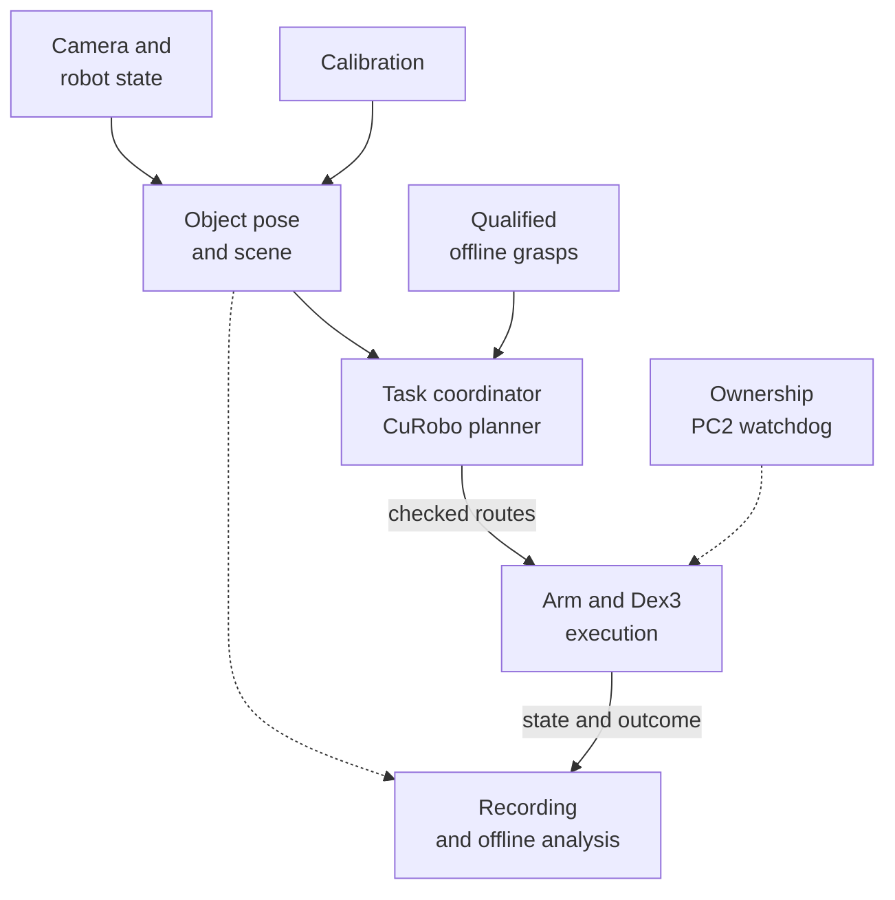

# System map and code entry points

Use this page when changing the tabletop code. The central question is:
**what must pass from a camera observation to a robot command, and which
component is responsible for each step?** For physical setup or operation,
start with the [hardware](../hardware/robot.md) or [runbook](../control/runbook.md).

The map below describes the demonstrated manipulation pipeline. It is a data
flow, not a startup sequence. Calibration is loaded as a model; grasp candidates
are generated offline. Neither is recomputed for each robot command.



## Enter through the component you want to reuse

| Component | Implementation entry points | Read alongside the code |
|---|---|---|
| Control and recovery | `PoseExecutor`, `ExecutorControlDriver`, `PC2DampingWatchdog` | [Ownership modes, continuous holding and verified handback](../control/ownership.md) |
| Recording and conversion | `RawEpisodeRecorder`, `convert_episode` | [Signals, lifecycle, completeness and alignment](../data/recording.md) |
| Perception and camera state | `observe_resting_cube`, `AnchoredCameraStateEstimator` | [Observation acceptance](../perception/object-pose.md), [body-motion correction](../perception/state-estimation.md) |
| Motion planning | `PersistentTabletopPlanner`, `TabletopPlanningSession` | [Measured geometry, commanded starts and recoverable routes](../manipulation/planning.md) |
| Grasp qualification | `run_atlas`, `build_shortlist` | [Frames and qualification stages](../manipulation/grasp-atlas.md) |
| Experimental calibration | `run_collect_bilateral_calibration`, `solve_bilateral_dataset` | [Model, retained evidence and collection limits](../calibration/workflow.md) |
| Passive tactile inspection | `Dex3PressureVisualizer` | [Raw slots, baseline and spatial mapping](../sensing/pressure.md) |

Each linked chapter maps these names to exact files. The
[code index](../reference/code-index.md) supplies pinned versions; [setup](setup.md)
describes separate environments. To see components composed into an application,
use `hardware_stack.py::run_stack` in the [cube-stacking case study](../manipulation/tasks.md).

## Preserve the interfaces when extending a component

| Boundary | Producer → consumer | What must survive |
|---|---|---|
| Object observation | Detector → planner | Object profile, rectified camera model, pose convention, accepted image hashes and measured snapshot |
| Camera propagation | Visual anchor/body state → boundary replan | Matching timestamps, reference frame and explicit fixed-origin assumption |
| Grasp candidate | Generator/qualifier → planner and hand controller | Immutable candidate ID, canonical frame, object geometry, fixed close intent and qualification profile |
| Planned route | GPU worker → controller | Matching scene/model/request, exact command start, checked trajectory and complete recovery route |
| Contact result | Hand controller → retention validator | Achieved fingers, commissioned empty-close reference and opposed-contact evidence |
| Calibration candidate | Session/solver → hardware configuration | Raw evidence, declared parameters, grouped validation and an explicitly selected bundle |
| Episode | Controller/recorder → analysis or training | Task outcome, ownership outcome and recording completeness as separate facts |

For example, a replacement planner may improve route quality while still being
unusable if it starts at measured arm joints instead of the currently streamed
command. A larger grasp pool may add no usable pickups if the approach or
closing sweep intersects the support. The chapter invariants explain these
interfaces in detail.

## Using this guide with an agent

Point the agent at the subsystem's Markdown page and its source checkout.
Have it read the purpose, assumptions and evidence, then trace the mapped
symbols before proposing a change. A useful task description is:

```text
Read docs/manipulation/planning.md and its mapped source functions.
Trace how the request becomes an installed plan. Explain which values are
measured and which are active commands, and identify the existing regression
checks before proposing changes. Report any source-version mismatch.
```

Where present, a diagram supplies relationships. Code links supply locations;
the explanation supplies meaning and limits. For calibration, read the [investigation summary](../calibration/investigation.md)
and the experimental branch's `AGENTS.md` first. If you have access to the
private detailed ledger, use its completed results and operator corrections too.

## Validation by subsystem

| Area | Result in the available record | Practical limit |
|---|---|---|
| Printed targets | Rounded AprilCubes and bilateral dorsal marker carriers | Nominal CAD does not establish manufactured accuracy |
| Pressure | Passive raw audit, baseline recording, mapping and RViz visualization | Raw counts; spatial probing was primarily on the right hand |
| Grasp library | Exact-hand descriptors, Isaac qualification, contact atlases, support studies | Simulated retention does not establish a tabletop pickup |
| Assembly | T/U/cube assembly and cube-to-box plans with visual replay | Symbolic attachment/drop, not physical magnetic assembly |
| Control | Measured acquisition, gravity feedforward, independent recovery, continuous command boundaries | Commissioning applies to recorded configurations |
| Manipulation | Physical 40/60 mm pickup/lift/replacement and direct stack trials | Completion is not a post-release placement measurement |
| Calibration | Reproducible capture, grouped evaluation, arm-geometry investigation | Residual remains; no September replacement bundle deployed |
| State estimation | Chair-motion study, hybrid observer, stationary-boundary integration | Fixed pelvis-origin assumption; no global position observability |
| Data | Raw MCAP and verified LeRobot conversion | Conversion loses full-rate ROS information |

## Evidence labels

**Physical** means a real robot or hand experiment is recorded. **Simulation**
means contact or dynamics under a named model. **Offline** means retained-data
replay, planning, fitting, or software checks. **Proposed** means the work was
described but not established as complete. **Current implementation** can still
require physical validation.

A physical failure followed by an offline fix is not yet a successful physical
retry. The chapters preserve that distinction. The [source map](../reference/sources.md)
distinguishes available source code from private journals and unreleased datasets.
